# h1 Sniff

Tarkemmat tehtävänannot viikon läksyihin löytyvät [täältä](https://terokarvinen.com/verkkoon-tunkeutuminen-ja-tiedustelu/#h1-sniff).

## x) Lue ja tiivistä
### x-1) Tero Karvinen, Wireshark - Getting Started

Ensimmäinen lue ja tiivistä -tehtävän artikkeli oli Karvisen [Wireshark - Getting Started](https://terokarvinen.com/wireshark-getting-started/).
- #### Asennuksesta ja käyttöönotosta
  - Asennus päivitysten jälkeen komennolla ``$ sudo apt-get install wireshark``.
  - Sallitaan ei-root -käyttäjien kaapata paketteja.
    - Sertifikaattivirheet voivat johtua väärästä kellonajasta, korjaa käyttäen ``$ timedatectl``-komentoa.
  - Lisää käyttäjä wireshark -ryhmään.
    - ``$ sudo adduser <käyttäjä> wireshark``
    - ``$ whoami``-komennolla selvität kuka olet, jos syystä tai toisesta olet unohtanut kyseisen tiedon.
  - Ryhmän saa käyttöön reloggaamalla tai käyttämällä komentoa ``$ newgrp wireshark``.
  - Viimeisenä käynnistetään ohjelman GUI komennolla ``$ wireshark``.
- #### Sniffaus, eli liikenteen kaappaus
  -  Valitaan verkkoliitäntä (interface), jossa on liikennettä.
  -  Vaihtoehto: käytä ``any`` kaikkeen näkyvään liikenteeseen.
  -  Sininen hain evä -ikoni käynnistää kaappauksen, punainen neliö -ikoni pysäyttää kaappauksen.
- #### Vianmääritys
  - Ei liikennettä? Luo liikennettä esimerkiksi selaamalla verkkoa.
  - Ei vieläkään? Tarkista ryhmäjäsenyys.
- #### Tallennus ja lataus
  - Tallennettua dataa voidaan analysoida kuten live-liikennettä.
- #### Tilastot ja analyysi
  - Endpoints - listaa hostit.
  - I/O Graphs - Liikenteen ajoitus.
  - Protocol hierarchy - protokollajakauma.
    - Huom! Poistamalla suodattimet näkee koko datan.
- #### Filtterit, suodattimet
  - Yleisimmät esimerkkisuodattimet:
    - dns - DNS-kyselyt.
    - tls - salattu liikenne (yleisin webissä).
    - http - salaamaton HTTP.
    - tcp.port == 443 - porttipohjainen suodatus.
    - ip.addr == x.x.x.x - IP-osoitteella suodatus.
    - frame contains "teksti" - merkkijonohaku
- #### TCP-keskustelu tekstinä
  - Toimii erityisesti salaamattomassa liikenteessä.
  - Kätevä esimerkiksi hyökkääjien käyttämien TCP-yhteyksien (esim. netcat) tarkasteluun.
- #### Mitä tästä voi sitten oppia?
  - Wiresharkilla voidaan analysoida verkkoliikennettä tehokkaasti.
  - Tarkkuus paranee rajaamalla dataa käyttäen suodattimia.
  - Salaamaton liikenne on suoraan luettavissa, salattuun tarvitaan lisää työkaluja.

### x-2) Tero Karvinen, Network Interface Names on Linux

Toisen lue ja tiivistä -tehtävän artikkeli oli Karvisen [Network Interface Names on Linux](https://terokarvinen.com/network-interface-linux/).

- Verkkoliitäntä vastaa verkkokorttia, mutta voi olla myös virtuaalinen (esim. loopback).
- Moderni Linux käyttää systemd:n nimeämiskäytäntöä, joka on pysyvä ja ennustettava.
- Etuliitteet kertovat liitännän tyypin:
  - en = Ethernet (langallinen)
  - wl = WiFi (langaton)
  - lo = loopback (localhost)
  - Esimerkiksi:
    - wlp4s0 = WiFi
    - enp1s0 = Ethernet
    - enx... = Ethernet + MAC osoite (x-kirjaimen jälkeen MAC-osoite)
  - Nimen loppuosa kuvaa laitteen sijaintia tai yksilöllistä tunnistetta.
    - Vanhat nimet (eth0, wlan0) eivät ole enää käytössä epäluotettavan nimeämisen vuoksi.
- Komennot tarkistamiseen:
  - ``ip a`` - liitännät
  - ``ip route`` - reititys
- Loopback-osoitteet:
  - IPv4: 127.0.0.1
  - IPv6: ::1
 
## a) Linuxin asentaminen virtuaalikoneeseen

Linuxin asentamisessa ei tullut vastaan ongelmia. Asentamisessa käytin apuna Karvisen [asennusohjetta](https://terokarvinen.com/2021/install-debian-on-virtualbox/) sekä omia [muistiinpanojani](https://github.com/jinpulol/Linux-Palvelimet/blob/main/h1.md) aiemmalta kurssilta.

### Käytetty työympäristö
Asennus suoritettiin kannettavalla tietokoneella, Lenovo Yoga Slim 7 Pro:lla (AMD Ryzen 7 5800H @ 3.20 GHz, 16 GB DDR4-3200, NVIDIA GeForce RTX 3050 laptop 4 GB GDDR6). Kannettavan käyttöjärjestelmä oli WIN11, versio 25H2.

Linuxin asentamiseen käytin Oraclen VM Virtual Box v7.2.6.

Asennetun Linuxin jakeluversio oli Debian 13.4 xfce työpöytäympäristöllä.

## b) 🚫🎣

Tehtävässä tuli osoittaa, että pystyn katkaisemaan ja palauttamaan virtuaalikoneen Internet-yhteyden.
Ensimmäisenä tietenkin tuli todistaa, että yhteys ensinnäkin toimii. Tämä onnistui pingaamalla komentokehoitteessa jotain luotettavaa osoitetta, esimerkiksi google.com tai googlen IP-osoitetta 8.8.8.8.

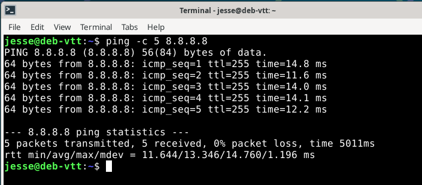

Tämän jälkeen poistin Ethernetin käytöstä Debianin oikean yläkulman verkkovalikosta. Tämän jälkeen testasin yhteyttä pingaamalla komentokehoitteessa uudelleen googlen IP-osoitetta. Vastaukseksi tuli ``ping: connect: Network is unreachable``, mikä siis tarkoittaa ettei koneella ole enää aktiivista verkkoreittiä kohteeseen. Yhteys on siis katkaistu.

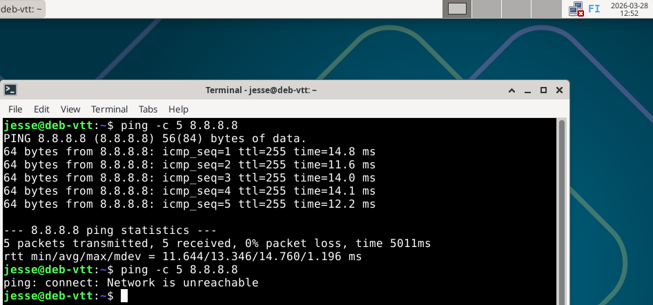

Verkkovalikosta Ethernetin kytkeminen takaisin päälle palautti yhteyden, ja pingaamalla sai taas yhteyden ulkomaailmaan.

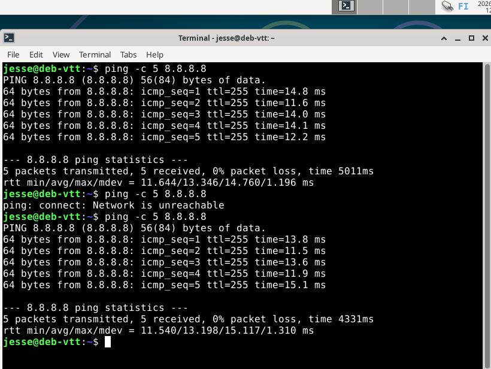

## c) Wireshark

Tehtävässä tuli asentaa Wireshark ja siepata sillä liikennettä. Asentaminen onnistui näppärästi x-1 -tehtävän artikkelin avulla. Asentamisessa ei ohjetta seurattaessa tullut vastaan ongelmia.

Sieppasin Wiresharkilla omaa liikennettä. Valitsin alussa siepattavaksi enp0s3-verkkoliitännän, joka on oma Ethernet-yhteyteni.

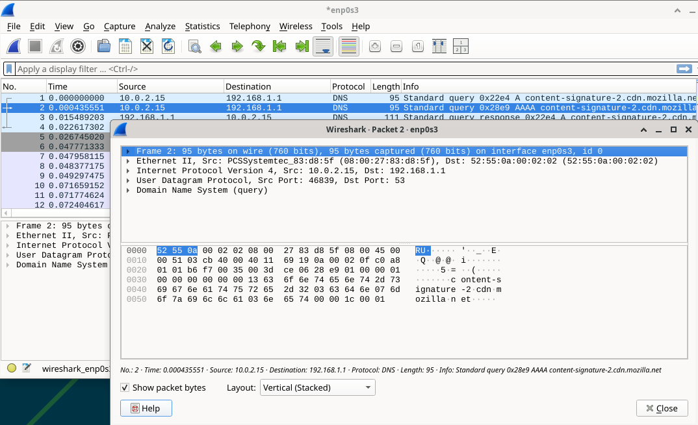

## d) Oikeesti TCP/IP

Osoitan tehtävään vaaditut TCP/IP neljä kerrosta hyödyntämällä edellisen tehtävän kuvakaappausta.

### Peruskerros:
- Ethernet II
  - Sisältää laitteen fyysiset osoitteet.
    - Lähde: ``08:00:27:83:d8:5f``
    - Kohde: ``52:55:0a:00:02:02``
  - Vastaa paketin siirrosta paikallisessa verkossa (virtuaalikone -> reititin).

### Verkkokerros:
- IPv4
  - Sisältää loogiset IP-osoitteet.
    - Lähde: ``10.0.2.15``
    - Kohde: ``192.168.1.1``
  - Vastaa paketin reitityksestä verkkojen välillä.

### Kuljetuskerros:
- UDP
  - Lähdeportti: ``46839`` - satunnainen portti
  - Kohdeportti: ``53`` - DNS
  - Vastaa sovellusten välisestä tiedonsiirrosta

### Sovelluskerros:
- DNS (Domain Name System)
  - Paketti on DNS-kysely
  - Tarkoituksena selvittää domain nimen IP-osoite.
    - Esimerkiksi, kun käyttäjä avaa verkkosivun

## e) Mitäs tuli surffattua?

Tehtävässä tuli selvittää mitä annetussa .pcap -tiedostosta voisi saada irti. Tiedostoa tuli tutkia Wiresharkilla yleisellä tasolla vastaten muutamiin kysymyksiin. Latasin ja avasin tiedoston virtuaalikoneen Wiresharkilla. 

Yleisellä tasolla kuvailuun tehtävänannossa mainittiin seuraavaa: _montako konetta näkyy, mitä protokollia pistää silmään. Määrästä voit arvioida esimerkiksi pakettien lukumäärää, kaappauksen kokoa ja kestoa._

Vastaukset näihin kaikkiin löytyivät x-1 -artikkelista. Statisticsin alta löytyivät muunmuassa Endpoints, I/O Graphics ja Protocol hierarchy.

Alla kuitenkin ensiksi kuva avatusta .pcap -tiedostosta.

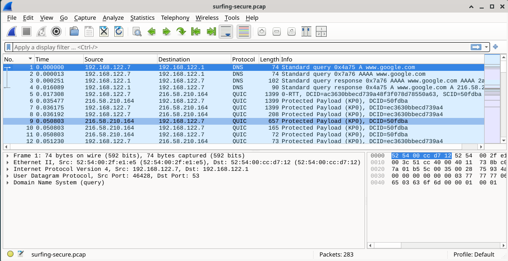

Lähdin tutkimaan tiedostoa ensimmäisenä montako tietokonetta kaappauksessa näkyy. Tämä tieto löytyi siis Statistics -> Endpoints. Endpoints -listasta löytyi 7 IP-osoitetta, jotka jakautuivat seuraavasti:

- Paikallinen verkko 2 kpl
  - 192.168.122.7 - Oma kone, eniten liikennettä
  - 192.168.122.1 - reititin / gateway
- Ulkoiset palvelimet 5 kpl
  - 3.75.10.80
  - 34.117.188.166
  - 135.181.139.209
  - 139.162.131.217 - aktiivisin palvelin
  - 216.58.210.164

Kaappauksesa on siis yksi asiakaskone, yksi reititin ja muutamia ulkoisia palvelimia.

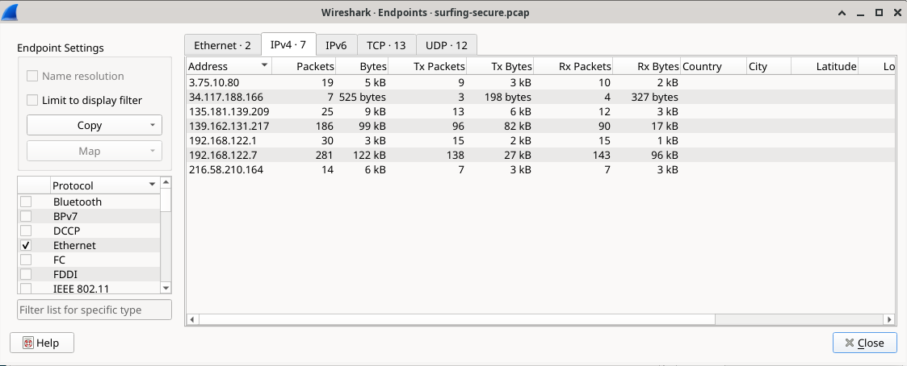

Seuraavaksi tutkin mitä protokollia mahdollisesti löydän kaappauksesta. Tämä tieto löytyi Statistics -> Protocol Hierarchy. Kaappauksesta löytyi seuraavia protokollia:

- Frame
  - Kehys, jolla kuvataan yksittäistä kaapattua pakettia.
  - Sisältää tiedot paketin koosta ja kaappauksesta.
- Eth (Ethernet)
  - Peruskerroksen protokolla.
  - Vastaa tiedonsiirrosta paikallisessa verkossa MAC-osoitteiden avulla.
- ARP
  - Selvittää IP-osoitetta vastaavan MAC-osoitteen.
  - Käytetään lähiverkossa ennen varsinaista liikennettä.
- IP (Internet Protocol)
  - Vastaa pakettien reitityksestä verkkojen välillä.
  - Sisältää lähde- ja kohde-IP-osoitteet.
- TCP
  - Yhteydellinen kuljetusprotokolla.
  - Takaa luotettavan tiedonsiirron (esim. verkkosivut).
- UDP
  - Yhteydetön kuljetusprotokolla.
  - Nopeampi, mutta epäluotettavampi tiedonsiirto.
- DNS
  - Muuntaa domain-nimet IP-osoitteiksi.
  - Näkyy usein verkkoselailun alussa.
- TLS
  - Salausprotokolla (HTTPS-liikenne).
  - Suojaa tiedonsiirron.
- QUIC
  - Moderni protokolla, joka toimii UDP:n päällä.
  - Käytössä erityisesti HTTPS-liikenteessä.

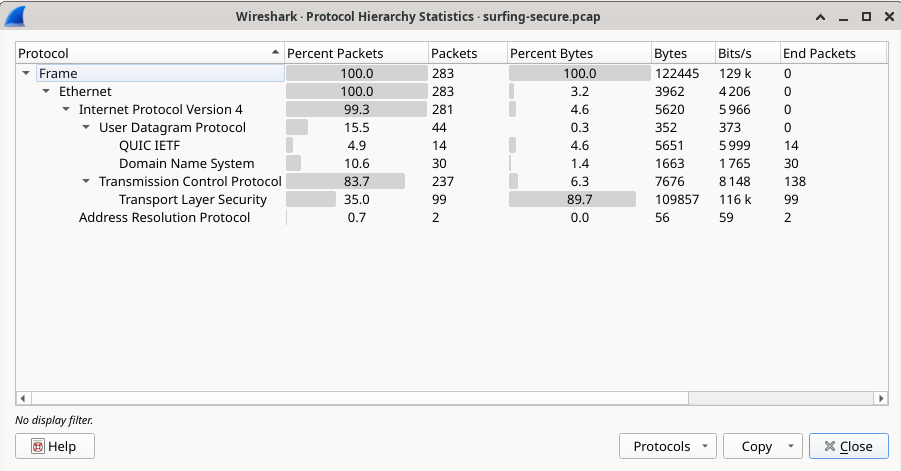

Pakettien lukumäärään, kaappauksen kokoon ja kestoon käytin kahta Statisticsin alta löytyvää tietoa. Ensimmäisenä katsoin I/O Graphin, mistä näkyy kaappauksen aikajakauma - eli miten liikenne on jakautunut ajallisesti.

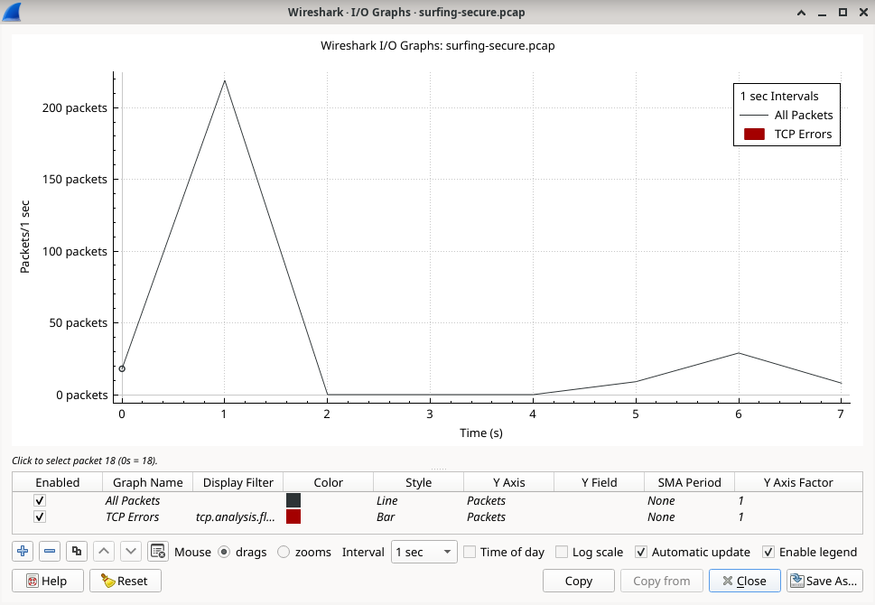

Toiseksi katsoin Statisticsin alta kaappauksen ominaisuudet (properties).

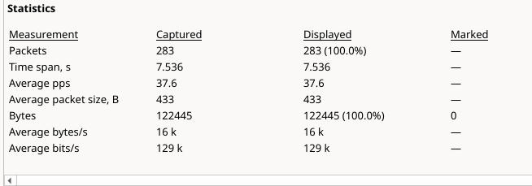

Näiden kahden tiedon avulla saadaan yhteenvedoksi, että kaappaus sisältää 283 pakettia ja kestää noin 7.5 sekuntia. Liikenne on määrältään melko vähäistä ja keskittyy lyhyeen ajanjaksoon kaappauksen alussa, mikä näkyy selkeänä piikkinä I/O-graafissa. Kaappauksen koko on noin 122 kB ja keskimääräinen pakettikoko 433 tavua.

## f) Mitä selainta käyttäjä käyttää?

Vapaaehtoinen tehtävä, tähän hetkeen skippiä.

## g) Minkä merkkinen verkkokortti käyttäjällä on?

Verkkokortin merkin voi selvittää tutkimalla minkä tahansa framen Ethernet II -osiota. Esimerkissä Source-osoite on ``52:54:00:2f:e1:e5``. Lisäksi Wireshark näyttää ``LG bit: Locally administered address (this is NOT the factory default)``. Nopea googletus haulla "52:54:00 mac address" antaa vahvistuksen epäilykselle: MAC-osoite viittaa virtuaaliseen verkkokorttiin. *Ilmeisesti QEMU?*

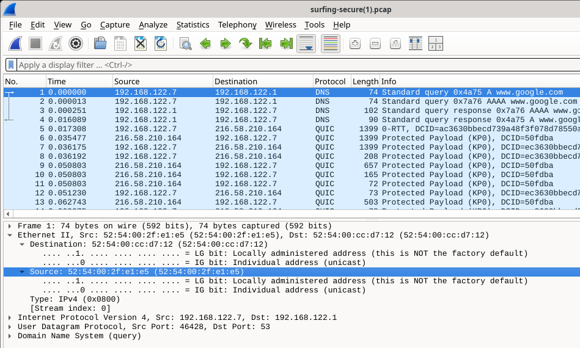

## h) Millä weppipalvelimella käyttäjä on surffaillut?

Rajasin tehtävään kaappauksen näyttämään vain DNS-kyselyt. Rajattujen tulosten perusteella, käyttäjä näyttää käyneen google.comissa sekä terokarvinen.comissa. Lisäksi on kyselyitä goatcounter.com ja gc.zgo.at, jotka molemmat googletuksen perusteella koskevat avoimen lähdekoodin sivustoanalytiikkaan. Kaappauksen perusteella terokarvinen.com -sivusto käyttää kyseistä sivustoanalytiikkaa.

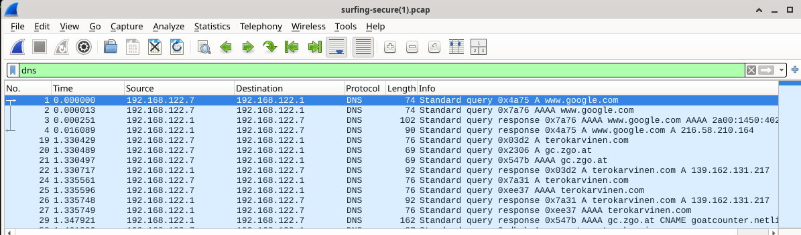

## i) Analyysi omasta liikenteestä

Kaappasin pienen pätkän liikennettäni, jossa avaan selaimen ja menen iltalehti.fi -sivustolle. Paketteja koko kaappauksessa tuli 1232, joskin tehtävää varten tarkastelen ensimmäistä 12 pakettia. Näissä 12 paketissa esiintyy kolmea eri vaihetta: DNS (paketit 0-3), TCP-yhteys (paketit 4-6) ja TLS (7-).

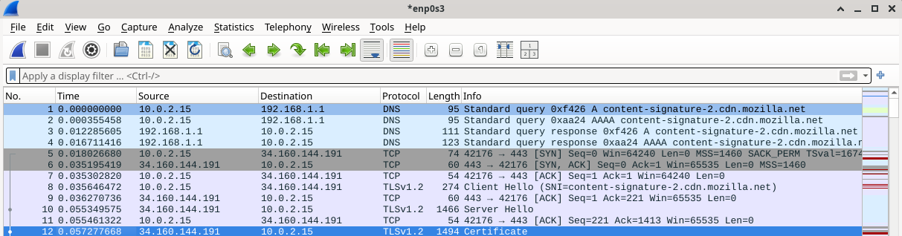

Kaappauksessa näkyy HTTPS-yhteyden muodostumisen alku. Ensin oma kone lähettää DNS-palvelimelle kyselyt nimestä ``content-signature-2.cdn.mozilla.net``. Nimestä kysytään sekä A- että AAAA-tietueet, eli sekä IPv4- että IPv6-osoitteet. DNS-palvelin vastaa ja palauttaa kohteelle IP-osoitteet. Tämä vaihe on välttämätön, koska selain tarvitsee palvelimen IP-osoitteen ennen verkkoyhteyden avaamista.

DNS-vaiheen jälkeen oma kone muodostaa TCP-yhteyden palvelimeen ``34.160.144.191`` porttiin 443. Tämä näkyy kolmivaiheisena TCP-kättelynä: ensin lähetetään syn-paketti (synchronize), palvelin vastaa syn-ack-paketilla (synchronize-acknowledgement) ja lopuksi asiakas kuittaa ack-paketilla (acknowledge). Tämän jälkeen luotettava TCP-yhteys on muodostettu. [Lisää tietoa täältä](https://developer.mozilla.org/en-US/docs/Glossary/TCP_handshake).

Kun TCP-yhteys on valmis, asiakas aloittaa TLS-kättelyn lähettämällä Client Hello -paketin. Tässä vaiheessa yhteyttä aletaan suojata salauksella. Paketissa näkyvä SNI-kenttä kertoo, mille palvelinnimelle yhteys on tarkoitettu. Palvelin vastaa Server Hello -paketilla ja lähettää tämän jälkeen sertifikaatin. Sertifikaatin tarkoitus on todistaa palvelimen identiteetti asiakkaalle. Näin yhteys voidaan muodostaa turvallisesti ennen varsinaisen verkkosisällön siirtoa. [Lisää tietoa täältä](https://www.ibm.com/docs/en/ibm-mq/9.3.x?topic=tls-overview-ssltls-handshake).

Kaappaus näyttää siis normaalin salatun verkkoyhteyden muodostumisen. Ensin tehdään nimenselvitys, sitten muodostetaan TCP-yhteys ja lopuksi aloitetaan TLS-salaus.

## Lähteet

Tero Karvinen
- https://terokarvinen.com/verkkoon-tunkeutuminen-ja-tiedustelu/#h1-sniff
- https://terokarvinen.com/wireshark-getting-started/
- https://terokarvinen.com/network-interface-linux/
- https://terokarvinen.com/2021/install-debian-on-virtualbox/

Jesse Lehmonen
- https://github.com/jinpulol/Linux-Palvelimet/blob/main/h1.md

Mozilla Developers
- https://developer.mozilla.org/en-US/docs/Glossary/TCP_handshake

IBM
- https://www.ibm.com/docs/en/ibm-mq/9.3.x?topic=tls-overview-ssltls-handshake
