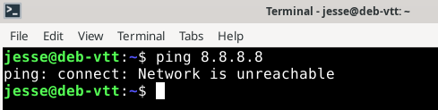
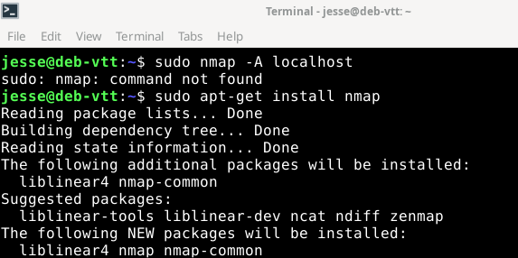
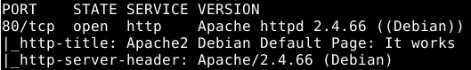
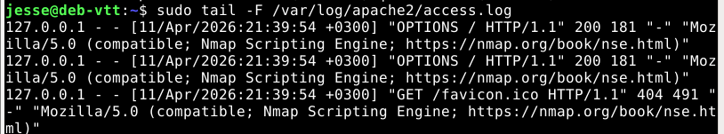
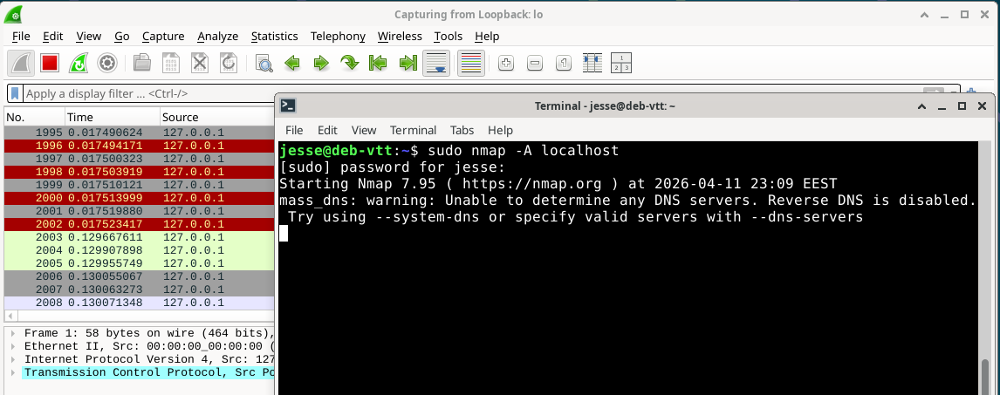
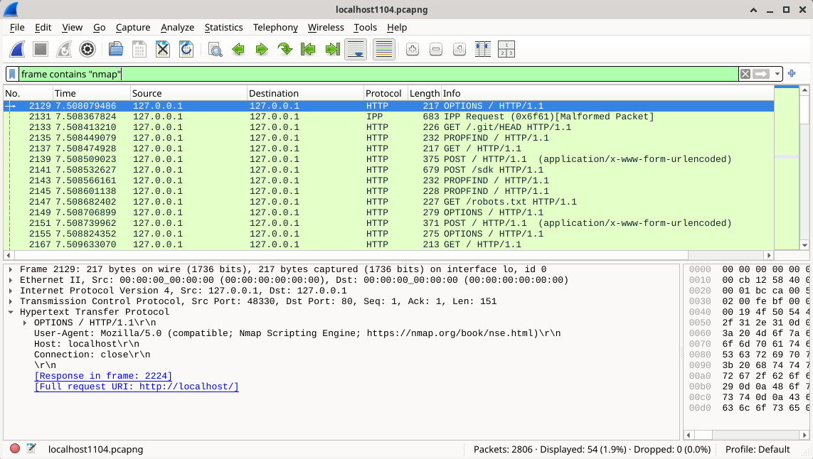
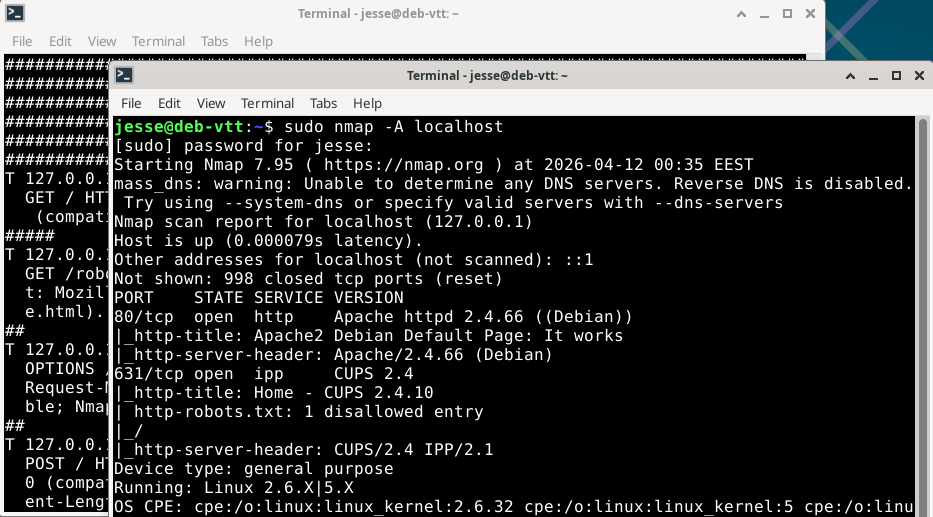
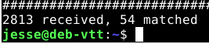
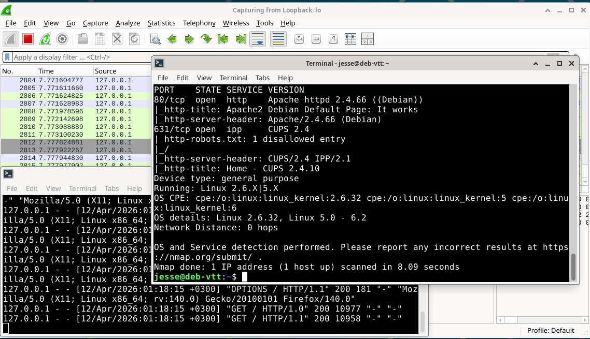
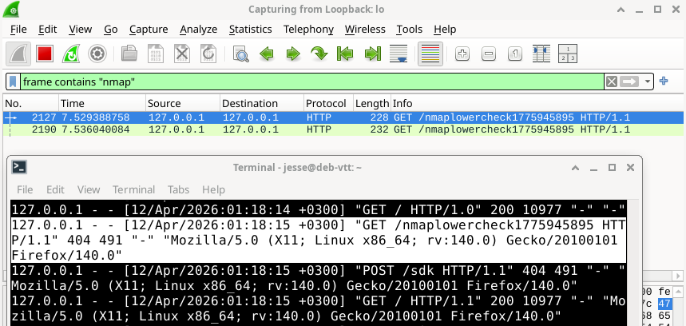

# h2 Lempiväri: violetti

Viikon läksyjen tarkemmat kuvaukset voi lukea [täältä](https://terokarvinen.com/verkkoon-tunkeutuminen-ja-tiedustelu/#h2-lempivari-violetti).

## x) Lue ja vastaa lyhyesti

Ensimmäisessä tehtävässä tuli silmäillä pari artikkelia, ja kiinnittää huomiota mm. tuskan pyramidiin (Pyramid of Pain) ja tunkeutumisanalyysin timanttimalliin.

### x-1) Bianco 2013: Pyramid of Pain

- Pyramid of Pain kuvaa, miten “kipeää” hyökkääjälle tekee, kun puolustus tunnistaa ja estää eri tasoisia havaintoja.
- Perusajatus on seuraava:
  - Mitä alemmalla tasolla tunnistus tapahtuu, sitä helpompi hyökkääjän on muuttaa hyökkäyksessä näkyviä yksityiskohtia.
  - Mitä ylemmällä tasolla tunnistus tapahtuu, sitä enemmän hyökkääjän on muutettava koko toimintamalliaan.

 Pyramid of Painin kuva David Biancon [blogista](https://detect-respond.blogspot.com/2013/03/the-pyramid-of-pain.html), jossa myös lisää aiheesta. 

### x-2) The Diamond Model of Intrusion Analysis

- Timanttimallilla kyberhyökkäystä katsotaan neljästä perusosasta: hyökkääjän, käytetyn keinon tai työkalun, hyökkäystä tukevan infrastruktuurin ja kohteen kautta.
Ajatuksena ei ole vain nimetä näitä osia, vaan ymmärtää miten ne liittyvät toisiinsa.
- Tietty työkalu tai hyökkäysmenetelmä voi viitata siihen, millainen hyökkääjä on kyseessä. Myös käytetty infrastruktuuri, kuten palvelin, verkkotunnus tai sähköpostiosoite, voi yhdistää saman toimijan useisiin eri hyökkäyksiin. Kohde puolestaan auttaa ymmärtämään hyökkäyksen tarkoitusta, koska valittu uhri voi paljastaa, mitä hyökkääjä tavoittelee ja miksi juuri tiettyjä keinoja tai väyliä on käytetty.

 Timanttimallin kuva Adam Gossin artikkelista Kraven Securityn [sivuilta](https://kravensecurity.com/diamond-model-analysis/), jossa myös lisää aiheesta. 

## a) Apache log

Toisessa tehtävässä tuli asentaa Apache-weppipalvelin paikalliselle virtuaalikoneelle, avata selaimella localhost ja etsiä tästä sivulatauksesta syntynyt lokirivi Apache-lokista. Valittu lokirivi tuli tämän jälkeen selittää auki.

Ennen tehtävän aloitusta olin päivittänyt pakettilistauksen virtuaalikoneen käynnistyksen jälkeen komennolla ``$ sudo apt-get update``.

Tehtävä alkoi asentamalla Apache weppipalvelin. Tämä onnistui yksinkertaisesti seuraavasti:
1. Asennus komennolla ``$ sudo apt-get install apache2``.
    - Asennus vaati ylimääräistä tilaa, ja kysyi haluanko jatkaa: Y (kyllä).
2. Asennuksen jälkeen weppipalvelimen käynnistys komennolla ``$ sudo systemctl start apache2``.
3. Tarkistus avaamalla localhost selaimella.

Seuraavaksi tuli avata Apachen lokitiedosto, ja löytää sieltä sivulatauksesta syntynyt lokirivi. Apachen lokit löytyvät polusta */var/log/apache2/*, ja näitä pääsi lukemaan komennolla ``$ sudo tail -F /var/log/apache2/access.log``. 
  - [-F](https://man7.org/linux/man-pages/man1/tail.1.html) (tail --follow=name --retry tiedosto) seuraa tiedoston nimeä ja avaa sen uudestaan, jos tiedosto vaihtuu tai luodaan uudelleen.

Omaa sivulataustani vastaava lokirivi on seuraava:

> 127.0.0.1 - - [11/Apr/2026:18:20:46 +0300] "GET / HTTP/1.1" 200 3383 "-" "Mozilla/5.0 (X11; Linux x86_64; rv:140.0) Gecko/20100101 Firefox/140.0"

Rivin analysointi:
- ``127.0.0.1``, lokirivi alkaa IP-osoitteella, josta pyyntö lähetettiin.
- Ensimmäinen viiva ``-`` on RFC1413 identd -tieto. Ilmeisesti jokin vanha internet-protokolla, jolla on kysytty mikä paikallinen käyttäjä on avannut TCP-yhteyden. Ei enää käytössä.
- Toinen viiva ``-`` on HTTP-autentikoinnilla tunnistettu käyttäjä. Sivua ei ole salasanalla suojattu, joten tunnistettua käyttäjää ei ole.
- ``[11/Apr/2026:18:20:46 +0300]`` on aikaleima, jolloin pyyntö on tapahtunut.
- ``GET / HTTP/1.1`` on HTTP-pyyntö
  - GET = selain pyytää sisältöä palvelimelta
  - / = sivuston juurihakemisto
  - HTTP/1.1 = käytetyn HTTP-protokollan versio
- ``200`` on HTTP-statuskoodi. 200 tarkoittaa, että pyyntö onnistui ja palvelin palautti sivun normaalisti.
- ``3383`` on palvelimen vastauksen koko tavuina.
- Kolmas viiva hipsuineen ``"-"`` on Referer-kenttä. Referer-kenttä kertoo miltä sivulta pyyntö on tullut. Viiva tarkoittaa, että kenttä on tyhjä. Tämä on normaalia, kun osoite avataan suoraan selaimeen.
- ``"Mozilla/5.0 (X11; Linux x86_64; rv:140.0) Gecko/20100101 Firefox/140.0"`` on User-Agent. Tämä kertoo asiakkaasta mm. käytetyn selaimen ja käyttöjärjestelmän.
  - Pyyntö on tullut Mozilla Firefox -selaimesta, selainversio 140.0.
  - Käytössä on 64-bittinen Linux (Linux x86_64).
  - Gecko/... on selaimen käyttämä selainmoottori.

Rivin analysointiin käytin apuna Sumo Logicin [artikkelia](https://www.sumologic.com/blog/apache-access-log) ja Apachen omaa [opasta](https://httpd.apache.org/docs/2.4/logs.html). User-Agentin purkamiseksi käytin Mozillan [developer](https://developer.mozilla.org/en-US/docs/Web/HTTP/Reference/Headers/User-Agent)-sivuja.

## b) Nmapped

Tehtävässä tuli porttiskannata oma weppipalvelin ja selittää tulokset.

Ensimmäisenä irroitin Debianin verkosta valitsemalla oikean yläkulman verkkovalikosta *Disconnect*. Tarkistin vielä yhteyden varmasti olevan poikki pingaamalla googlen DNS:ää ``$ ping 8.8.8.8``. Vastauksena sain ``ping: connect: Network is unreachable``. Verkko on siis katkaistu.

Ensimmäisellä yrittämällä porttiskannata localhostia komennolla ``$ sudo nmap -A localhost`` ei onnistunut. Virheilmoitus ``sudo: nmap: command not found`` kertoi selkeästi, ettei nmappia ole asennettuna vielä. Palautin verkon asennuksen ajaksi ja asensin nmapin ``$ sudo apt-get install nmap``.
Asentamisen jälkeen verkko uusiksi irti ja testaus pingillä.

>Nmap -A tarkoittaa aggressiivista skannausta. Skannaus sisältää mm. käyttöjärjestelmän tunnistuksen, palveluiden versioiden tunnistuksen, skriptiskannauksen ja tracerouten. Lisää aiheesta nmapin [dokumentaatiosta](https://nmap.org/book/man-misc-options.html).

Toisella yrittämällä porttiskannaus komennolla ``$ sudo nmap -A localhost`` onnistui. Tehtävässä riitti selittää pelkästään http-portin 80/tcp -tulokset.

Tuloksista käy ilmi seuraavaa:
- ``80/tcp  open  http    Apache httpd 2.4.66 ((Debian))``
  - 80/tcp on tavallinen HTTP-verkkopalvelimen portti.
  - open - portti on auki ja siihen saa yhteyden.
  - http - Nmap tunnisti palveluksi HTTP:n
  - Apache httpd 2.4.86 (Debian) - Palvelimessa pyörii Apachen weppipalvelin, versio 2.4.66, Debian-järjestelmässä.
- ``|_http-title: Apache2 Debian Default Page: It works``
  - HTTP-vastaus palautti title-tagin. Apachessa pyörii oletussivu.
- ``|_http-server-header: Apache/2.4.66 (Debian)``
  - HTTP-vastauksen Server-otsake kertoo vielä kerran käynnissä olevan weppipalvelimen, tämän version ja ympäristön.
 
## c) Skriptit

Q: Mitkä skriptit olivat automaattisesti päällä, kun käytit "-A" -parametriä?

- http-title
  - Näyttää web-palvelimen oletussivun otsikon eli käytännössä HTML-sivun <title>-tiedon.
- http-server-header
  - Lukee HTTP-vastauksen server-otsakkeen ja käyttää sitä palvelun versiotietojen täydentämiseen.
- http-robots.txt 
  - Tarkistaa, löytyykö palvelimelta /robots.txt-tiedosto, ja etsii siitä Disallow-merkintöjä eli polkuja, joita roboteille ei haluta indeksoitavan.
- Vastausten apuna käytetty NSE scriptien [dokumentaatiota](https://nmap.org/nsedoc/scripts/).

## d) Jäljet lokissa

Etsi weppipalvelimen lokeista jälkiä porttiskannauksesta ja selitä osumat. Millaisilla hauilla tai säännöillä voisi tunnistaa porttiskannauksen jostain toisesta, laajemmasta lokista?

Tehtävässä menin lukemaan uudelleen Apachen lokeja komennolla ``$ sudo tail -F /var/log/apache2/access.log``. Vastauksessa löytyi useampi rivi, josta löytyi ``Nmap Scripting Engine``-jälki.

- Lokista löytyi sana Nmap User-Agent-kentästä: ``Mozilla/5.0 (compatible; Nmap Scripting Engine; https://nmap.org/book/nse.html)``.
  - Tämä osoittaa, että web-palvelimeen tehtiin pyyntöjä Nmapin NSE-skripteillä.
- Useat OPTIONS / -pyynnöt viittaavat palvelimen HTTP-ominaisuuksien ja sallittujen metodien kartoittamiseen.
- GET /favicon.ico -pyyntö liittyy palvelun tai sivuston tunnistamiseen; vastauksena saatiin 404, eli tiedostoa ei löytynyt.
- GET / -pyynnöt näyttävät etusivun hakemista, mikä sopii esimerkiksi http-title- ja http-server-header-skriptien toimintaan.

Liian suuri loki luettavaksi? Etsisin toistuvia osumia sanalle nmap tai merkkijonolle nmap scripting engine. Lisäksi tarkistaisin tuleeko samasta IP-osoitteesta paljon erilaisia pyyntöjä lyhyessä ajassa. Tähän varmasti löytyy skriptejä. *Editoin ehkä myöhemmin tähän kyseisen skriptin.*

## e) Wiresharking

Sieppaa verkkoliikenne porttiskannatessa Wiresharkilla. Etsi tallennetusta pcap-tiedostosta kohdat, joissa on sana "nmap" ja kommentoi niitä.

Ensimmäisenä käynnistin Wiresharkin ja valitsin sen sieppaamaan localhostia, eli ``Loopback: lo``:ta. Avasin uuden päätteen, jolla porttiskannasin localhostia komennolla ``$ sudo nmap -A localhost``. Porttiskannauksen käynnistämisen jälkeen taustalla oleva Wireshark alkoi myös sieppaamaan liikennettä.

Pysäytin tämän jälkeen sieppauksen Wiresharkissa, ja tallensin esillä olevan sieppauksen nimellä ``localhost1104``. Tiedosto löytyi helposti nimellä, kun halusin avata tallennetun tämän tutkittavaksi. Rajasin sieppauksen tuloksia display filterin avulla, käyttäen rajausta ``frame contains "nmap". Tuloksia löytyi alun reilun 2800 sijasta nyt enää 54 kappaletta.

Analyysiä tuloksista:
- Yllä olevan yhden paketin tulos:
  - Paketti etenee TCP/IP-mallin neljän kerroksen kautta: linkkikerros, verkkokerros, kuljetuskerros ja sovelluskerros.
    - Tämä näkyy Wiresharkissa riveinä Ethernet II, Internet Protocol Version 4, Transmission Control Protocol ja Hypertext Transfer Protocol.
  - Paketissa näkyy Nmapin NSE-skriptin tekemä HTTP-pyyntö porttiin 80.
    - ``Dst Port: 80``
    - ``User-Agent: Mozilla/5.0 (compatible; Nmap Scripting Engine; https://nmap.org/book/nse.html)``
  - ``OPTIONS / HTTP/1.1`` viittaa siihen, että Nmap selvittää weppipalvelimen tukemia HTTP-toimintoja.
    - Lisäksi / viittaa, että pyyntö kohdistuu juuripolkuun.
  - Lähde- ja kohdeosoite ovat molemmat 127.0.0.1, joten liikenne tapahtuu localhostin sisällä loopback-liitännässä.
- Yleisesti tarkasteltuna suurin osa tuloksista koostuu HTTP-pyynnöistä ja -vastauksista.
- Liikenteessä esiintyy erityisesti metodeja OPTIONS, GET ja POST, mikä todennäköisesti viittaa weppipalvelun toiminnan ja ominaisuuksien tarkasteluun.
- Yleisten metodien lisäksi PROPFIND-metodia ilmenee aika paljon.
  - WebDAV-metodi, jolla haetaan resurrsin tai hakemiston ominaisuuksia.
    - WebDAV on HTTP-protokollan laajennus, joka mahdollistaa tiedostojen ja hakemistojen käsittelyn web-palvelimella etänä.
  - Lähde: https://http.dev/webdav

## f) Net grep

Sieppaa verkkoliikenne 'ngrep' komennolla ja näytä kohdat, joissa on sana "nmap".

Tehtävänannon vinkeistä löytyi komento ``$ sudo ngrep -d lo -i nmap``. Ngrepin [dokumentaation](https://linux.die.net/man/8/ngrep) perusteella komennolla:
- -d valitaan kuunneltava verkkoliintäntä. Tässä tapauksessa lo = loopback, localhost.
- -i etsitään annettava merkkijono KiRjAiNkOoStA riippumatta.
- nmap on etsittävä merkkijono.

Komento ei kuitenkaan mennyt ensi yrittämällä läpi: ``sudo: ngrep: command not found``. Osasin odottaa virheilmoitusta, sillä aiemmassa tehtävässä myös nmap piti asentaa ensin. Kuten nmapin kohdalla, yhdistin Debianin asennuksen ajaksi verkkoon, ja asensin ngrepin ``$ sudo apt-get install ngrep``.
Asennuksen jälkeen katkaisin verkkoyhteyden ja varmistin yhteyden olevan poikki pingaamalla ulkomaailmaa.

Toinen yrittämä onnistui myös ngrepin kanssa. ``$ sudo ngrep -d lo -i nmap`` -komento alkoi sieppaamaan liikennettä. Avasin toisen komentorivin, jolla porttiskannasin localhostin ``$ sudo nmap -A localhost``. Jälleen kerran porttiskannauksen alettua alkoi sieppauksessakin käymään hulina.

Nmapin ajettua porttiskannaus läpi, pysäytin myös sieppauksen CTRL+C. Ngrep antoi tulokseksi 2813 pakettia, joista 54 osui etsimääni ``nmap``-merkkijonoon.

## g) Agentti

Vaihda nmapin user-agent niin, että se näyttää tavalliselta weppiselaimelta.

Tehtävänannon vinkeistä löytyi nmap-skripti, jolla user-agent -kentän pyyntö tulee erittäin mielenkiintoisesta kokoonpanosta. Käytin tehtävässä hyväksi siis skriptiä ``--script-args http.useragent="BSD experimental on XBox350 alpha (emulated on Nokia 3110)"``. Apache-lokin tulkinnassa otin myös ylös tavallisen weppiselaimen user-agent -kentän tiedot, jotka siis olivat ``"Mozilla/5.0 (X11; Linux x86_64; rv:140.0) Gecko/20100101 Firefox/140.0"``.

Lopullinen komento seuraavaan tehtävään on siis: ``$ sudo nmap --script-args http.useragent="Mozilla/5.0 (X11; Linux x86_64; rv:140.0) Gecko/20100101 Firefox/140.0" localhost``.

## h) Pienemmät jäljet

Porttiskannaa weppipalvelin uudelleen localhost-osoitteella, nyt kun user-agent on muutettu. Tarkastele sekä Apachen lokia että siepattua verkkoliikennettä. Mikä on muuttunut?

Käynnistin tehtävään Wiresharkin sieppaamaan localhostia, sekä yhden komentorivin seuraamaan Apachen lokia komennolla ``$ sudo tail -F /var/log/apache2/access.log`` Sieppauksen alettua syötin toiseen komentoriviin aiemman tehtävän komennon ``sudo nmap -A --script-args http.useragent="Mozilla/5.0 (X11; Linux x86_64; rv:140.0) Gecko/20100101 Firefox/140.0" localhost``.

Porttiskannauksen alettua Wireshark alkoi sieppaamaan heti liikennettä, ja skannauksen tultua valmiiksi myös Apachen-lokeissa pyörähti uusia tapahtumia.

Apachen lokitiedostoissa User-Agent on vaihtunut Nmapin tunnisteesta Firefoxin tunnisteeseen.
- Esimerkki vanhasta lokirivistä: ``127.0.0.1 - - [12/Apr/2026:00:35:44 +0300] "OPTIONS / HTTP/1.1" 200 181 "-" "Mozilla/5.0 (compatible; Nmap Scripting Engine; https://nmap.org/book/nse.html)"``
- Esimerkki uudesta lokirivistä: ``127.0.0.1 - - [12/Apr/2026:01:18:15 +0300] "OPTIONS / HTTP/1.1" 200 181 "-" "Mozilla/5.0 (X11; Linux x86_64; rv:140.0) Gecko/20100101 Firefox/140.0"``

Myös Wiresharkissa User-Agent on vaihtunut Nmapin tunnisteesta Firefoxin tunnisteeseen.
- Esimerkki vanhasta: ``User-Agent: Mozilla/5.0 (compatible; Nmap Scripting Engine; https://nmap.org/book/nse.html)\r\n``
- Esimerkki uudesta: ``User-Agent: Mozilla/5.0 (X11; Linux x86_64; rv:140.0) Gecko/20100101 Firefox/140.0\r\n``

Sekä Wiresharkissa että Apachen lokitiedoissa näkyy kuitenkin vielä ``GET /nmaplowercheck1775945895 HTTP/1.1``. User-Agentin vaihtaminen vaikutti hyvin paljon nmapin näkyvyyteen, mutta ei riittäny poistamaan kaikkia jälkiä.

## i) LoWeR ChEcK

Hieman vaikeampi, poista scriptiskannauksesta viimeinenkin nmap-teksti.

Tehtävän palasia, mahdollinen toteutus olisi mahdollisesti ollut seuraava:
- Etsi löytämääsi tekstiä /usr/share/nmap -hakemistosta:
  - Löytämäni teksti ``GET /nmaplowercheck17...``.
    - GET on HTTP-metodi ja numerosarja todnäk jokin yksilöivä tunniste, jäljelle jää``nmaplowercheck``.
      - Selvitys, mikä nmaplowercheckNRO tarkalleen on.
  - "Etsi ja korvaa" -> Etsi lua-skripti josta teksti löytyy ja korvaa se toisella.
    - Lua-scriptiä muokataan, nmaplowercheckin tilalla lukee nyt nakkisoppa.
  - Avataan Apache-loki ja Wireshark kuten aikaisemmassa tehtävässä ja ajetaan firefox-scriptattu nmap-komento.
  - Tarkistetaan onko nmappia, tarkistetaan löytyykö nakkisoppa

## j) FCC ID

Etsi valitsemasi langattoman laitteen tiedot FCC ID:llä ja mitä tästä selviää?

- Valitsin laitteekseni omat langattomat kuulokkeeni, JBL Live Pro 2 TWS. Niiden FCC ID on APILIVEPRO2TWS.
- FCC-asiakirjoista selvisi, että laite käyttää Bluetooth 5.2 -tekniikkaa.
- Laitteen toimintataajuus on 2402–2480 MHz, joten se toimii Bluetoothille tyypillisellä 2,4 GHz taajuusalueella.
- Bluetoothin modulaatiot ovat GFSK, π/4-DQPSK ja 8DPSK.

## Lähteet

Tero Karvinen
- https://terokarvinen.com/verkkoon-tunkeutuminen-ja-tiedustelu/#h2-lempivari-violetti

David Bianco - Pyramid of Pain
- https://detect-respond.blogspot.com/2013/03/the-pyramid-of-pain.html

Adam Goss / Kraven Security - Diamond Model
- https://kravensecurity.com/diamond-model-analysis/

Linux man pages - Tail
- https://man7.org/linux/man-pages/man1/tail.1.html

Sumo Logic - Apache Access Log
- https://www.sumologic.com/blog/apache-access-log

Apache HTTP Server Documentation - Log Files
- https://httpd.apache.org/docs/2.4/logs.html

Mozilla Dev Network - User-Agent
- https://developer.mozilla.org/en-US/docs/Web/HTTP/Reference/Headers/User-Agent

 Nmap Documentations
 - https://nmap.org/book/man-misc-options.html
 - https://nmap.org/nsedoc/scripts/

http.dev - WebDAV
- https://http.dev/webdav

linux.die.net - ngrep
- https://linux.die.net/man/8/ngrep

