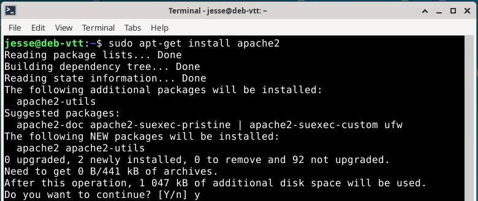
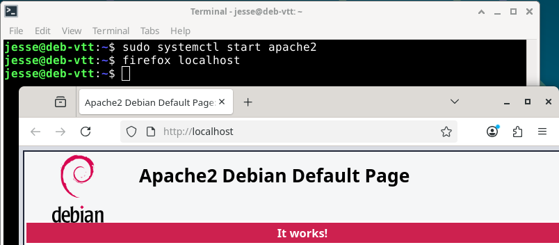
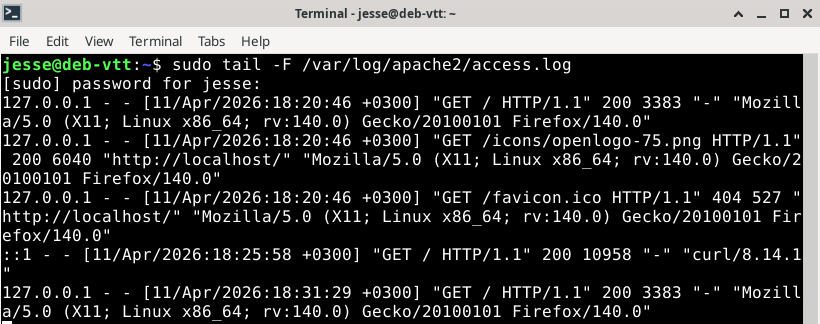

# h2 Lempiväri: violetti

Viikon läksyjen tarkemmat kuvaukset voi lukea [täältä](https://terokarvinen.com/verkkoon-tunkeutuminen-ja-tiedustelu/#h2-lempivari-violetti).

## x) Lue ja vastaa lyhyesti

Ensimmäisessä tehtävässä tuli silmäillä pari artikkelia, ja kiinnittää huomiota mm. tuskan pyramidiin (Pyramid of Pain) ja tunkeutumisanalyysin timanttimalliin.

### x-1) Bianco 2013: Pyramid of Pain

- Pyramid of Pain kuvaa, miten “kipeää” hyökkääjälle tekee, kun puolustus tunnistaa ja estää eri tasoisia havaintoja.
- Perusajatus on seuraava:
  - Mitä alemmalla tasolla tunnistus tapahtuu, sitä helpompi hyökkääjän on muuttaa hyökkäyksessä näkyviä yksityiskohtia.
  - Mitä ylemmällä tasolla tunnistus tapahtuu, sitä enemmän hyökkääjän on muutettava koko toimintamalliaan.

 Pyramid of Painin kuva David Biancon [blogista](https://detect-respond.blogspot.com/2013/03/the-pyramid-of-pain.html), jossa myös lisää aiheesta. 

### x-2) The Diamond Model of Intrusion Analysis

- Timanttimallilla kyberhyökkäystä katsotaan neljästä perusosasta: hyökkääjän, käytetyn keinon tai työkalun, hyökkäystä tukevan infrastruktuurin ja kohteen kautta.
Ajatuksena ei ole vain nimetä näitä osia, vaan ymmärtää miten ne liittyvät toisiinsa.
- Tietty työkalu tai hyökkäysmenetelmä voi viitata siihen, millainen hyökkääjä on kyseessä. Myös käytetty infrastruktuuri, kuten palvelin, verkkotunnus tai sähköpostiosoite, voi yhdistää saman toimijan useisiin eri hyökkäyksiin. Kohde puolestaan auttaa ymmärtämään hyökkäyksen tarkoitusta, koska valittu uhri voi paljastaa, mitä hyökkääjä tavoittelee ja miksi juuri tiettyjä keinoja tai väyliä on käytetty.

 Timanttimallin kuva Adam Gossin artikkelista Kraven Securityn [sivuilta](https://kravensecurity.com/diamond-model-analysis/), jossa myös lisää aiheesta. 

## a) Apache log

Toisessa tehtävässä tuli asentaa Apache-weppipalvelin paikalliselle virtuaalikoneelle, avata selaimella localhost ja etsiä tästä sivulatauksesta syntynyt lokirivi Apache-lokista. Valittu lokirivi tuli tämän jälkeen selittää auki.

Ennen tehtävän aloitusta olin päivittänyt pakettilistauksen virtuaalikoneen käynnistyksen jälkeen komennolla ``$ sudo apt-get update``.

Tehtävä alkoi asentamalla Apache weppipalvelin. Tämä onnistui yksinkertaisesti seuraavasti:
1. Asennus komennolla ``$ sudo apt-get install apache2``.
    - Asennus vaati ylimääräistä tilaa, ja kysyi haluanko jatkaa: Y (kyllä).
2. Asennuksen jälkeen weppipalvelimen käynnistys komennolla ``$ sudo systemctl start apache2``.
3. Tarkistus avaamalla localhost selaimella.

Seuraavaksi tuli avata Apachen lokitiedosto, ja löytää sieltä sivulatauksesta syntynyt lokirivi. Apachen lokit löytyvät polusta */var/log/apache2/*, ja näitä pääsi lukemaan komennolla ``$ sudo tail -F /var/log/apache2/access.log``. 
  - [-F](https://man7.org/linux/man-pages/man1/tail.1.html) (tail --follow=name --retry tiedosto) seuraa tiedoston nimeä ja avaa sen uudestaan, jos tiedosto vaihtuu tai luodaan uudelleen.

Omaa sivulataustani vastaava lokirivi on seuraava:

> 127.0.0.1 - - [11/Apr/2026:18:20:46 +0300] "GET / HTTP/1.1" 200 3383 "-" "Mozilla/5.0 (X11; Linux x86_64; rv:140.0) Gecko/20100101 Firefox/140.0"

Rivin analysointi:
- ``127.0.0.1``, lokirivi alkaa IP-osoitteella, josta pyyntö lähetettiin.
- Ensimmäinen viiva ``-`` on RFC1413 identd -tieto. Ilmeisesti jokin vanha internet-protokolla, jolla on kysytty mikä paikallinen käyttäjä on avannut TCP-yhteyden. Ei enää käytössä.
- Toinen viiva ``-`` on HTTP-autentikoinnilla tunnistettu käyttäjä. Sivua ei ole salasanalla suojattu, joten tunnistettua käyttäjää ei ole.
- ``[11/Apr/2026:18:20:46 +0300]`` on aikaleima, jolloin pyyntö on tapahtunut.
- ``GET / HTTP/1.1`` on HTTP-pyyntö
  - GET = selain pyytää sisältöä palvelimelta
  - / = sivuston juurihakemisto
  - HTTP/1.1 = käytetyn HTTP-protokollan versio
- ``200`` on HTTP-statuskoodi. 200 tarkoittaa, että pyyntö onnistui ja palvelin palautti sivun normaalisti.
- ``3383`` on palvelimen vastauksen koko tavuina.
- Kolmas viiva hipsuineen ``"-"`` on Referer-kenttä. Referer-kenttä kertoo miltä sivulta pyyntö on tullut. Viiva tarkoittaa, että kenttä on tyhjä. Tämä on normaalia, kun osoite avataan suoraan selaimeen.
- ``"Mozilla/5.0 (X11; Linux x86_64; rv:140.0) Gecko/20100101 Firefox/140.0"`` on User-Agent. Tämä kertoo asiakkaasta mm. käytetyn selaimen ja käyttöjärjestelmän.
  - Pyyntö on tullut Mozilla Firefox -selaimesta, selainversio 140.0.
  - Käytössä on 64-bittinen Linux (Linux x86_64).
  - Gecko/... on selaimen käyttämä selainmoottori.

Rivin analysointiin käytin apuna Sumo Logicin [artikkelia](https://www.sumologic.com/blog/apache-access-log) ja Apachen omaa [opasta](https://httpd.apache.org/docs/2.4/logs.html). User-Agentin purkamiseksi käytin Mozillan [developer](https://developer.mozilla.org/en-US/docs/Web/HTTP/Reference/Headers/User-Agent)-sivuja.

