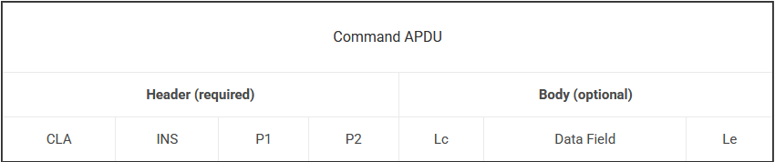

# h4 - NFC ja RFID

## a) Käytössäni olevat RFID-tuotteet

*Tarkastele käytössäsi olevia RFID tuotteita, mieti miten hyvin olet suojautunut RFID urkinnalta?*

Mielestäni olen suojautunut RFID-urkintaa vastaan melko hyvin. Käytössäni olevat merkittävät tuotteet:
- Pankkikortit, joita säilytän aivan tavallisessa lompakossa.
  - Suojaus perustuu lähinnä kortteihin asetettuihin mataliin käyttörajoihin, sekä sananlaskuun "tyhjästä on paha nyhjästä".
- Puhelimen NFC-toiminto ei yleensä ole päällä, joten se ei muodosta merkittävää riskiä.
- Passi on kotona jemmassa.

Käytössäni ei ole kulkutageja, matkakortteja, älyavaimia tai älykelloja, jotka lisäisivät RFID-urkinnan mahdollisuutta. Suurin mahdollinen riskikohta ovat pankkikortit, ja tätäkin riskiä voisi vähentää RFID-suojatulla lompakolla.

## b) APDU?

*Tutustu APDU komentojen rakenteeseen (voit käyttää tekoälyä tutustumiseen).*

APDU-komentojen rakenne:
- APDU (Application Protocol Data Unit) on älykorttien käyttämä viestimuoto.
- APDU-rakenne koostuu tavuista, ja komennot sekä vastaukset esitetään tavallisesti heksadesimaalisena tavujonona.
- APDU:n avulla kortinlukija tai muu laite lähettää komentoja kortille ja vastaanottaa kortin vastauksia.
  - APDU-viestien päätyypit:
    - Command APDU - kortille lähtevä komento.
      - Määrittelee, mitä kortin halutaan tekevän, esimerkiksi valitsevan sovelluksen tai palauttavan tietoa.
    - Response APDU - kortin palauttama vastaus.
      - Vastaus voi sisältää varsinaisen datan lisäksi tilatiedon siitä, onnistuiko annettu komento.
- APDU-rakenne perustuu ISO/IEC 7816-4 -standardiin.
  - Älykorttien sovellus- ja komentotason standardi, joka määrittelee ennen kaikkea, miten kortin ja lukijan välinen viestinvaihto rakennetaan ja tulkitaan.
 

Kuvakaappaus Command APDU:n rakenteesta CardLogixin sivulta.
 
Command APDU:
- Command APDU jakautuu kahteen osaan, Headeriin (pakollinen) ja Bodyyn (valinnainen).
  - Headerin kentät:
    - CLA (Class Byte) - komentoluokan tavu, joka kertoo, mihin komentoluokkaan käsky kuuluu.
    - INS (Instruction Byte) - käskytavu, joka kertoo, mikä varsinainen komento suoritetaan.
      - Esimerkiksi komento voi pyytää valitsemaan sovelluksen tai lukemaan dataa.
    - P1 ja P2 (Parameter Bytes) - parametrikentät, joilla tarkennetaan käskyä.
      - Käytännössä antavat lisätietoa siitä, miten INS-käsky pitäisi suorittaa.
  - Bodyn kentät:
    - Lc - kertoo, kuinka monta tavua komennon mukana lähetetään dataa.
      - Jos dataa ei ole, kenttä voi puuttua kokonaan.
    - Data - varsinainen lähetettävä sisältö.
      - Esimerkiksi sovelluksen tunniste, kortille kirjoitettava tieto tai muu komentoon liittyvä data.
    - Le - kertoo, kuinka monta tavua vastauksesta odotetaan dataa.

Response APDU:
- Response APDU jakautuu kahteen osaan, Dataan (valinnainen) ja Status-kenttiin (pakollinen).
  - Data - kortin palauttama varsinainen sisältö.
    - Tätä ei aina ole mukana, koska kaikki komennot eivät palauta dataa.
    - Esimerkiksi vastaus voi sisältää kortilta luettua tietoa.
  - Status-kentät:
    - SW1 ja SW2 (Status Word #) - ensimmäinen ja toinen tilatavu.
      - Kertovat komennon lopputuloksen.
     
Esimerkkinä ``FF CA 00 00 00``, jota voidaan käyttää NFC-tagin yksilöllisen tunnisteen eli UID:n lukemiseen:
  - FF = CLA, kertoo mihin komentoluokkaan käsky kuuluu.
  - CA = INS, kertoo mikä komento suoritetaan.
  - Ensimmäinen 00 = P1, ensimmäinen parametri.
  - Toinen 00 = P2, toinen parametri.
  - Kolmas 00 = Le, vastauksen odotettu pituus.
  - Huom! Komento ei ole täyttä 7 tavua pitkä!
    - Yleensä 5 tavun komennot ovat header + le.
    - Jos komento on tätä pidempi, viides tavu on yleensä Lc (sen jälkeen Data ja viimeisenä Le).
   
Vastaukseksi voidaan saada ``04 7A 1C 92 90 00``:
  - Kaksi viimeistä tavua ovat aina Status-kentät.
  - ``04 7A 1C 92`` on näin ollen Dataa, josta käy ilmi tagin palauttama UID.
  - ``90 00`` on SW1 ja SW2 tilatavuista muodostuva tilakoodi, joka tässä tapauksessa tarkoittaa onnistunutta komentoa.
  
Tehtävässä käyttämät lähteet: [CardLogix, APDUs](https://www.cardlogix.com/glossary/apdu-application-protocol-data-unit-smart-card/), [OBP, ISO/IEC Standardit](https://www.iso.org/obp/ui/#iso:std:iso-iec:7816:-4:ed-4:v1:en), [PassNinja, NFC Tutorial: What are APDUs?](https://www.passninja.com/tutorials/nfc-protocols/what-are-apdus) ja [Oraclen Java Card -dokumentaatio](https://docs.oracle.com/en/java/javacard/3.1/jc_api_srvc/api_classic/javacard/framework/APDU.html). Tehtävässä on hyödynnetty ChatGPT:tä kääntämisessä, käsitteiden avaamisessa sekä tekstin muotoilun tukena.

## c) Unsaflok

*Tutki ja kerro minkä mielenkiintoisen RFID hakkerointi uutiset löysit.*

Löysin [artikkelin](https://www.kaspersky.com/blog/unsaflok-forging-keycards-for-hotel-doors/51292/) sekä [sivuston](https://unsaflok.com/) aiheesta Unsaflok.

Unsaflok on Saflok-hotellilukkoihin liittyvä RFID-haavoittuvuusketju, jonka avulla hyökkääjä voi tehdä väärennettyjä avainkortteja ja avata ovia. Kasperskyn yhteenvedon ja Unsaflok-sivuston mukaan tapaus koskee yli 3 miljoonaa lukkoa, noin 13 000 hotellia ja 131 maata.

Hyökkäys perustuu siihen, että hyökkääjä lukee yhden hotellin avainkortin, esimerkiksi oman huoneensa kortin tai vanhentuneen kortin, ja käyttää siitä saatua tietoa uusien korttien tekemiseen. Lähteiden mukaan tähän riittävät yleiset RFID/NFC-työkalut.

Tutkijat ilmoittivat löydöksestä valmistajalle syyskuussa 2022. Korjaukset alkoivat marraskuussa 2023, mutta Unsaflok-sivuston mukaan maaliskuuhun 2024 mennessä noin 36 % vaikutuspiirissä olevista lukoista oli päivitetty tai vaihdettu. Päivittäminen on hidasta, koska korjaus ei ole pelkkä ohjelmistopäivitys: hotelleissa on käytävä läpi lukot, kortit, taustajärjestelmät ja niiden yhteensopivuus paikan päällä, usein kohde kerrallaan.

Tehtävän lähteet: Kaperskyn [artikkeli](https://www.kaspersky.com/blog/unsaflok-forging-keycards-for-hotel-doors/51292/) ja [unsaflok](unsaflok.com)-sivusto.

## Lähteet

CardLogix: Application Protocol Data Unit (APDU)
- https://www.cardlogix.com/glossary/apdu-application-protocol-data-unit-smart-card/

Online Browsing Platform: ISO/IEC 7816-4:2020
- https://www.iso.org/obp/ui/#iso:std:iso-iec:7816:-4:ed-4:v1:en

Richard Grundy, PassNinja: What are APDUs? Application Protocol Data Units explained
- https://www.passninja.com/tutorials/nfc-protocols/what-are-apdus

Oracle, Javacard: Class APDU
- https://docs.oracle.com/en/java/javacard/3.1/jc_api_srvc/api_classic/javacard/framework/APDU.html

Alanna Titterington, Kaspersky Daily: Unsaflok: vulnerable locks on three million hotel room doors
- https://www.kaspersky.com/blog/unsaflok-forging-keycards-for-hotel-doors/51292/

Unsaflok
- https://unsaflok.com/

