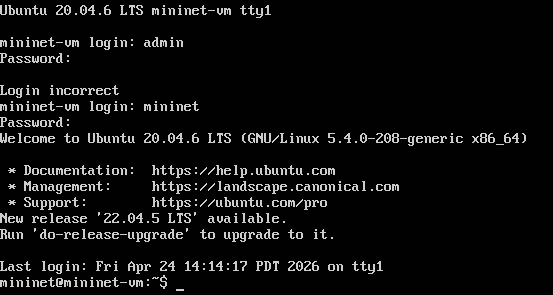
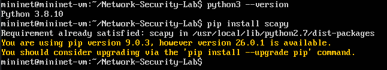
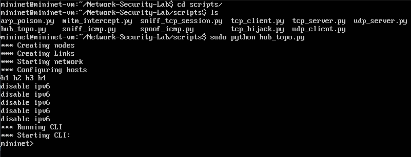
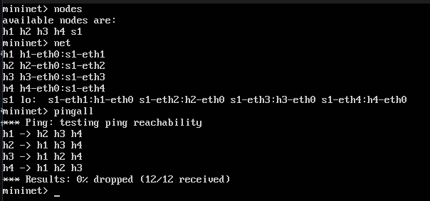
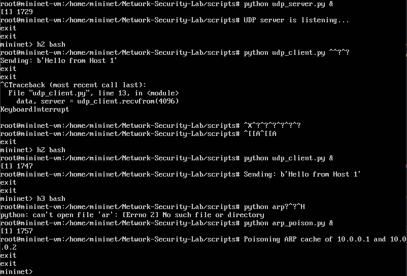
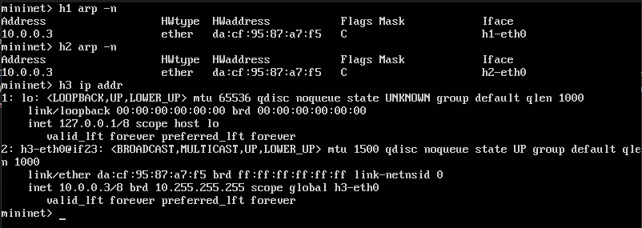
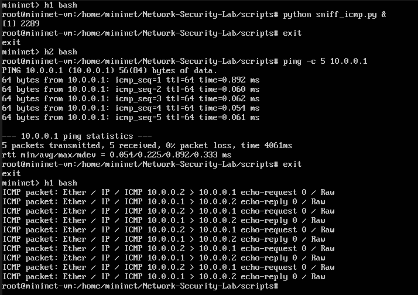
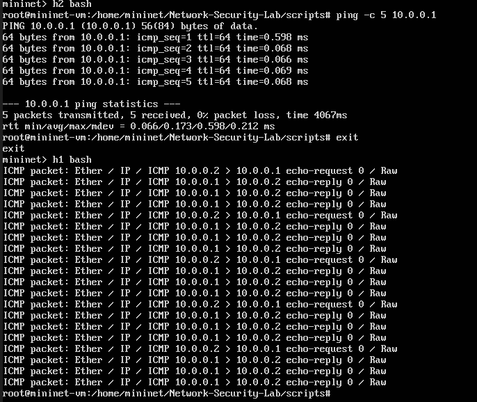
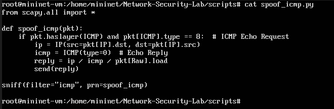
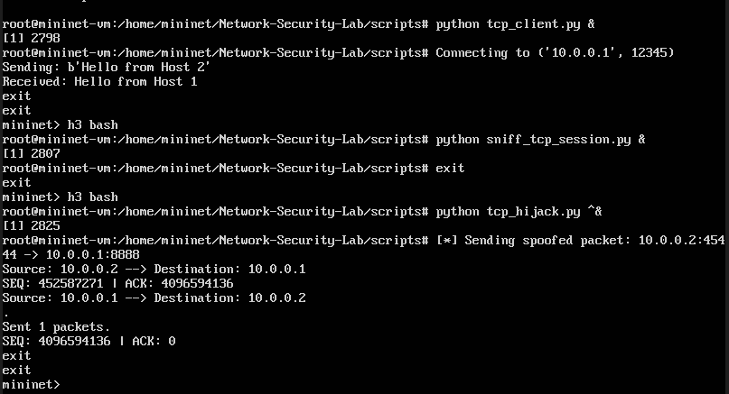

# h5 Laboratorio- ja simulaatioympäristöt hyökkäyksissä

### Tehtävissä käytetty työympäristö
- Lenovo Yoga Slim 7 Pro (AMD Ryzen 7 5800H @ 3.20 GHz, 16 GB DDR4-3200, NVIDIA GeForce RTX 3050 laptop 4 GB GDDR6). WIN11, versio 25H2.
- Oracle VirtualBox 7.2.6
  - Mininet 2.3.0, Ubuntu 20.04.01 Server 64-bit

### Viikon tehtävänannot

> a) Aja tunnilla esitetty ARP hyökkäys ja tutki, miten se toimii.\
> b) Samassa hakemistossa on myös ICMP Spoofing ja TCP Session Hijacking. Aja molemmat labrat läpi ja kerro, miten molemmat tekniikat toimivat.\
> c) Hakemistossa 02-SDN-DDos_Simulation tryout-kansiossa on työkalut, jotta voit ajaa TCP SYN-Flood-hyökkäyksen turvallisesti.
>   - Kirjoita, miten ajoit hyökkäyksen ja miten kyseinen hyökkäys toimii.
> 
> d) Vapaaehtoinen tutustu myös seuraaviin työkaluihin
>   - https://evilginx.com/
>   - https://github.com/utoni/ptunnel-ng
>
> Kerro kyseisistä työkaluista, mitä ne tekevät, saitko asennettua ne, lisää ohjeraporttiin ja olivatko kyseiset työkalut mielenkiintoisia, jos olivat, niin miksi? Pohdi raportissasi, mihin ja missä tilanteissä kyseisiä työkaluja voidaan käyttää? Arvioi, onko käyttö kohde moraalisesti oikein tai väärin.

## Valmistelut kohti a)-tehtävää

En ollut viikon tunnilla, joten aloitin tehtävän asentamalla Mininet-virtuaalikoneen käyttämääni Oracle VM VirtualBoxiin.

Asennus:
- Latasin ja purin pakatun tar.xz-tiedoston kurssin materiaalista.
  - Levykuvan purkaminen ei onnistunut Windowsin graafisen käyttöliittymän kautta. Windowsin Resurssienhallinta kaatui purkamisen aikana, mikä koneelleni ei ole uutta.
  - Purin tiedoston Windowsin komentokehotteessa komennolla ``tar -xf tiedostonimi.tar.xz``. Tar-komentoa [käytetään](https://www.linux.fi/wiki/Tar) tar-pakettien käsittelyyn, x tarkoittaa purkamista ja f määrittää tiedoston.
- Loin uuden virtuaalikoneen Oracle VM Virtualboxiin:
  - VM Name: Mininet
  - OS: Linux
  - OS Distro: Ubuntu
  - OS Version: Ubuntu 64-bit
  - Use an Existing Virtual Hard Disk File: Etsin tähän purkamastani kansiosta vmdk-tiedoston.
- Tarkistin, että virtuaalikone käynnistyy oikein.

Käynnistyksessä tuli vastaan hyvin yksinkertainen ongelma: mitkä ovat virtuaalikoneen tunnukset? Selasin viikon materiaalit läpi, joista en löytänyt tarvittavia tunnuksia. Koska kyseessä oli harjoituslabra, oletin tunnusten olevan jokin yleinen ja helposti arvattava yhdistelmä. Kokeilin ensin admin-admin -paria, mikä oli väärin. Toinen yritys mininet-mininet -parilla taasen onnistui, ja pääsin kirjautumaan harjoitusympäristöön.

Seuraavaksi tuli pohtia, mikä oli tunnilla esitetty ARP-hyökkäys. Materiaalista löytyi pakattu tar.xz-tiedosto, jonka sisältä löytyi muutamia Labs-harjoituksia. Materiaalista löytyi myös diaesitys, jonka lopussa oli esitettynä sama harjoitus, kuin yksi Labs-kansiosta löytynyt tehtävä. Kotitehtävien b)-osuus viittasi myös tähän tehtävään, joten aloitin tutustumalla seuraavaan tehtävään:

> https://github.com/ssam246/Network-Security-Lab \
> **Task 2: MITM Attack Using ARP Cache Poisoning** \
> This task demonstrates a **Man-in-the-Middle** attack by using ARP cache poisoning. By sending malicious ARP responses, an attacker can intercept and alter communications between two hosts.

Aloitin tehtävän kloonaamalla materiaalista löytyvän GitHub-repositorion Mininet-virtuaalikoneelle komennolla ``git clone https://github.com/ssam246/Network-Security-Lab.git``. Tämän jälkeen siirryin kloonattuun hakemistoon komennolla ``cd Network-Security-Lab``.

``Network-Security-Lab``-hakemistosta löytyi ``README.md``-tiedosto ja ``scripts``-kansio; samat tiedostot ja kansiot löytyivät myös GitHubin lähderepositoriosta. Ennen labraharjoituksia tarkistin myös ``README.md``-tiedoston mukaisesti, että minulla on käytössäni Python 3.x skriptien ajamiseen ja Scapy-kirjasto verkkopakettien käsittelyyn ja luomiseen. ``Python3 --version`` vastasi versioksi ``Python 3.8.10`` ja ``pip install scapy`` ilmoitti Scapyn olevan jo asennettuna ``Requirement already satisfied: scapy ...``. Komento ilmoitti myös vanhasta ``pip``-versiosta, johon en sen enempää kiinnittänyt huomiota. Tämän jälkeen esivalmistelut olivatkin valmiit.

## a) ARP-hyökkäys

Siirryin ``Network-Security-Lab``-hakemistossa olevaan scripts-kansioon komennolla ``cd scripts/``. Tarkistin hakemiston sisällön ``ls``-komennolla. Hakemistosta löytyivät harjoituksessa tarvittavat Python-skriptit, kuten ``udp_client.py``, ``udp_server.py`` ja ``arp_poison.py``, sekä ympäristön käynnistämiseen tarvittava ``hub_topo.py``. Käynnistin harjoituksessa käytettävän Mininet-ympäristön komennolla ``sudo python hub_topo.py``. Komento loi tarvittavan verkkotopologian, johon kuuluivat hostit h1, h2, h3 ja h4.

Mininet-ympäristön käynnistämisen jälkeen tarkistin luodun verkon rakenteen komennoilla ``nodes``, ``net`` ja ``pingall``.
- ``nodes``-komento näytti, että ympäristöön oli luotu neljä hostia ja yksi kytkin: h1, h2, h3, h4 ja s1.
- ``net``-komennolla tarkistin hostien ja kytkimen väliset yhteydet. Vastauksesta näkyi, että kaikki hostit oli yhdistetty samaan kytkimeen s1. Hostilla h1 oli yhteys kytkimen porttiin s1-eth1, hostilla h2 porttiin s1-eth2 jne.
- Lopuksi testasin hostien välisen yhteyden ``pingall``-komennolla. Testissä kaikki hostit saivat yhteyden toisiinsa, ja tulokseksi tuli ``0% dropped (12/12 received)``. Kaikki näytti siis toimivan oikein.

Materiaalia aiemmin selatessani löysin aiheen diaesityksestä ``xterm``-komennon. [Komennolla](https://mininet.org/walkthrough/#xterm-display) pystyy avaamaan Mininet-hosteille erillisiä terminaali-ikkunoita, jolloin esimerkiksi eri hosteilla ajettavia palvelin-, asiakas- ja hyökkäysskriptejä voidaan seurata samanaikaisesti omissa ikkunoissaan.

Yritin avata erilliset terminaali-ikkunat hosteille komennolla ``xterm h1 h2 h3``, mutta komento ei toiminut. ``Error: Cannot connect to display``. Kurssimateriaalissa oli ohje xterm-ongelmien korjaamiseen ``get_xauth.sh``-skriptillä ja ``xauth``-komennolla. Kokeilin tätä ratkaisua lisäämällä MIT-MAGIC-COOKIE-1-rivin pääkäyttäjän xauth-tietoihin, mutta xterm ei tämänkään jälkeen auennut toimivasti.

En löytänyt ongelmaan ratkaisua nopealla googletuksella, joten kysyin tekoälyltä apua. Kysymys oli käytännössä: ``mininet xterm ei toimi, vaihtoehtoja python scriptien ajamiseen?``. Tekoäly ehdotti xterm-ikkunoiden sijaan esimerkiksi hostien omien komentoympäristöjen hyödyntämistä. Hostin omaan komentoympäristöön pääsee esimerkiksi komennolla h1 bash, jonka jälkeen skriptejä voi ajaa normaalisti komennolla python3 script.py. Hostin shellistä poistutaan komennolla exit. Lisäksi komennon loppuun voi lisätä &-merkin, jolloin komento käynnistyy taustaprosessina ja Mininetin komentorivi vapautuu muiden komentojen suorittamista varten.

Harjoituksessa käytettiin siis kolmea Mininet-hostia. Roolit olivat siis seuraavat:

| Host | Rooli | Ajettava skripti |
|---|---|---|
| h1 | UDP-palvelin | `udp_server.py` |
| h2 | UDP-asiakas | `udp_client.py` |
| h3 | Hyökkääjä / ARP poisoning | `arp_poison.py` |

Avasin ensin ``h1`` komentoympäristön komennolla ``h1 bash``. Käynnistin UDP-palvelimen scripts-hakemistossa komennolla ``python udp_server.py &``. Komennon lopussa käytetty ``&`` jätti palvelimen käyntiin taustalle. Tuloste ``UDP server is listening...`` kertoi, että palvelin käynnistyi onnistuneesti.

Tämän jälkeen poistuin ``h1``:stä komennolla ``exit`` ja avasin hostin ``h2`` komennolla ``h2 bash``. Käynnistin UDP-asiakkaan komennolla python ``udp_client.py``. Ensimmäinen ajo jäi kai odottamaan jonkinsortin vastausta ja ``exit``-komento ei toiminut, joten keskeytin sen näppäinyhdistelmällä Ctrl+C. Tämän jälkeen käynnistin asiakkaan uudelleen taustalle komennolla ``python udp_client.py &``.

Lopuksi avasin hostin ``h3`` komentoympäristön komennolla ``h3 bash``. Ensimmäinen yritys käynnistää ARP-skripti epäonnistui kirjoitusvirheen vuoksi. Tämän jälkeen ajoin oikean komennon ``python arp_poison.py &``. Skripti käynnistyi ja tulosti ilmoituksen ``Poisoning ARP cache of 10.0.0.1 and 10.0.0.2``, mikä viittaa siihen, että ARP cache poisoning -hyökkäys käynnistyi hostien h1 ja h2 välillä.

ARP poisoning -skriptin käynnistämisen jälkeen tarkistin ARP-taulut komennoilla ``h1 arp -n`` ja ``h2 arp -n``. Lisäksi tarkistin hyökkääjänä toimivan hostin h3 IP- ja MAC-osoitteet komennolla ``h3 ip addr``.

Tuloksista näkyi seuraavaa:
- h3-hostin MAC-osoite on da:cf:95:87:a7:f5.
- h1 arp -n näyttää IP-osoitteelle 10.0.0.3 saman MAC-osoitteen da:cf:95:87:a7:f5.
- h2 arp -n näyttää IP-osoitteelle 10.0.0.3 saman MAC-osoitteen da:cf:95:87:a7:f5.

Tässä vaiheessa havainto osoitti, että h3 näkyi h1:n ja h2:n ARP-välimuisteissa. Jätin tehtävän tähän havaintoon.

*Onnistuneessa Man in the Middle -asemassa tilanne oletettavasti olisi ollut seuraava:*
- *h1 osoittaa h2 IP:n, mutta h3 MAC-osoitteen.*
- *h2 osoittaa h1 IP:n, mutta h3 MAC-osoitteen.*

## b) ICMP Spoofing ja TCP Session Hijacking

ICMP Spoofing:

Tehtävän hostien roolit ja skriptit:

| Host | Rooli                      | Ajettava komento / skripti |
| ---- | -------------------------- | -------------------------- |
| h1   | ICMP-liikenteen kuuntelija | `sniff_icmp.py`            |
| h2   | Ping-pyyntöjen lähettäjä   | `ping -c 5 10.0.0.1`       |
| h3   | Hyökkääjä / ICMP spoofing  | `spoof_icmp.py`            |

Aloitin tehtävän puhtaalta pöydältä sulkemalla vanhan mininet ympäristön, ja avaamalla sen uudestaan komennolla ``sudo python hub_topo.py``. ``README.md``-tiedoston ohjeistus tähän tehtävään oli seuraava: 
- Host 1: python sniff_icmp.py
- Host 2: ping 10.0.0.1

Aloitin avaamalla hostin ``h1`` komentoympäristön komennolla ``h1 bash``. Tämän jälkeen käynnistin ICMP-liikenteen tarkkailuun tarkoitetun skriptin ``sniff_icmp.py &``. Skripti jäi kuuntelemaan verkon ICMP-paketteja.

Seuraavaksi poistuin ``h1``:stä ja avasin hostin ``h2`` komentoympäristön komennolla ``h2 bash``. Hostilta ``h2`` lähetin viisi ping-pakettia hostille ``h1`` komennolla ``ping -c 5 10.0.0.1``. Ping-komennon tuloksesta näkyi, että kaikki viisi pakettia menivät perille ja vastaukset saatiin takaisin: ``5 packets transmitted, 5 received, 0% packet loss``.

Tämän jälkeen palasin tarkastelemaan ``h1``:llä ajettua ``sniff_icmp.py``-skriptiä. Tulosteessa näkyi vuorotellen ``ICMP echo request``- ja ``echo reply`` -paketteja osoitteiden ``10.0.0.2`` ja ``10.0.0.1`` välillä. Tämä osoitti, että skripti pystyi havaitsemaan h2:n ja h1:n välisen ICMP-liikenteen.

ICMP-liikenteen tarkastelun jälkeen siirryin varsinaiseen spoofausosaan. Avasin hyökkääjähostina käytetyn ``h3``-hostin komentoympäristön komennolla ``h3 bash`` ja ajoin ``spoof_icmp.py``-skriptin. Tämän jälkeen siirryin hostille ``h2`` ja lähetin uudelleen viisi ping-pakettia hostille ``h1`` komennolla ``ping -c 5 10.0.0.1``.

Ping-komennon tulos näytti jälleen, että kaikki viisi pakettia menivät perille: ``5 packets transmitted, 5 received, 0% packet loss``. Tämän jälkeen palasin tarkastelemaan hostilla ``h1`` käynnissä olleen ``sniff_icmp.py``-skriptin tulostetta. Tällä kertaa ``h1``:n snifferin tulosteessa ``echo reply`` -paketteja näkyi enemmän suhteessa lähetettyihin ping-pyyntöihin.

Tarkistin tämän jälkeen vielä ``spoof_icmp.py``-skriptin toimintaa ``h3``-hostin komentoympäristössä komennolla cat ``spoof_icmp.py``. Kysyin myös tekoälyltä nopean selityksen skriptin toiminnasta. Skriptissä käytettiin Scapy-kirjastoa ICMP-pakettien kuunteluun ja luomiseen. Kun skripti havaitsi ICMP echo request -paketin, se muodosti siihen itse ICMP echo reply -vastauksen vaihtamalla alkuperäisen paketin lähde- ja kohde-IP-osoitteet keskenään. Tämän jälkeen skripti lähetti muodostetun paketin verkkoon.

Tämä selitti, miksi spoofaus-skriptin ajamisen jälkeen verkossa näkyi enemmän echo reply -paketteja: hyökkääjähosti pystyi lähettämään ping-vastauksia, jotka näyttivät tulevan siltä hostilta, jolle ping alun perin lähetettiin.

TCP Session Hijacking:

Tehtävän hostien roolit ja skriptit:

| Host | Rooli | Ajettava skripti |
|---|---|---|
| h1 | TCP-palvelin | `tcp_server.py` |
| h2 | TCP-asiakas | `tcp_client.py` |
| h3 | Hyökkääjä / TCP-istunnon kuuntelu | `sniff_tcp_session.py` |
| h3 | Hyökkääjä / TCP session hijacking | `tcp_hijack.py` |

TCP Session Hijacking -harjoituksessa aloitin käynnistämällä TCP-palvelimen hostilla ``h1``. Avasin hostin komentoympäristön komennolla ``h1 bash`` ja ajoin ``tcp_server.py &``-skriptin taustalle. Tämän jälkeen poistuin hostilta komennolla ``exit``.

Seuraavaksi avasin hostin ``h2`` komentoympäristön ja käynnistin TCP-asiakkaan komennolla ``python tcp_client.py &``. Asiakas muodosti yhteyden osoitteeseen ``10.0.0.1`` porttiin ``12345``, lähetti viestin ``Hello from Host 2`` ja sai vastaukseksi ``Hello from Host 1``. Tämä osoitti, että TCP-yhteys hostien ``h1`` ja ``h2`` välillä toimi.

Tämän jälkeen käytin hostia ``h3`` hyökkääjähostina. Avasin ensin ``h3``:n komentoympäristön ja käynnistin ``sniff_tcp_session.py &``-skriptin taustalle TCP-istunnon tarkkailua varten. Lopuksi avasin ``h3``:n uudelleen ja ajoin ``tcp_hijack.py``-skriptin. Skriptin tulosteessa näkyi, että se lähetti väärennetyn TCP-paketin osoitteesta ``10.0.0.2`` osoitteeseen ``10.0.0.1``. Tulosteessa näkyivät myös TCP-yhteyteen liittyvät SEQ- ja ACK-arvot.

## c) TCP-SYN-Flood -hyökkäys

Aikataulullisista syistä en ehtinyt tutustumaan tehtävään ennen palautusta. Jatkan tehtävää myöhemmin alla olevan editin perään.

❗❗Seuraavat kohdat ovat tehty palautuksen jälkeen:❗❗

## Lähteet
Linux.fi
- tar: https://www.linux.fi/wiki/Tar

Stephen Sam, Github
- Network Security Lab: https://github.com/ssam246/Network-Security-Lab

Mininet Walkthrough
- XTerm Display: https://mininet.org/walkthrough/#xterm-display

OpenAI
- ChatGPT, GPT-5-kielimalli
