# h7 Aaltoja harjaamassa

Tarkemmat tehtävän annot löytyvät [täältä](https://terokarvinen.com/verkkoon-tunkeutuminen-ja-tiedustelu/#h7-aaltoja-harjaamassa).

### Tehtävissä käytetty työympäristö
- Lenovo Yoga Slim 7 Pro (AMD Ryzen 7 5800H @ 3.20 GHz, 16 GB DDR4-3200, NVIDIA GeForce RTX 3050 laptop 4 GB GDDR6). WIN11, versio 25H2.
- Oracle VirtualBox 7.2.6
  - Linux Debian 13.4 (64-bit)

## x) Lue ja tiivistä

> Lue ja tiivistä:
> 1. Hubacek 2019: [Universal Radio Hacker SDR Tutorial on 433 MHz radio plugs](https://www.youtube.com/watch?v=sbqMqb6FVMY&t=199s) (3:19-7:40).
> 2. Cornelius 2022: [Decode 433.92 MHz weather station data](https://www.onetransistor.eu/2022/01/decode-433mhz-ask-signal.html).

### Hubacek 2019: Universal Radio Hacker SDR Tutorial on 433 MHz radio plugs
  - URH:lla voidaan nauhoittaa radioliikennettä ja analysoida signaalia visuaalisesti.
  - Signaalista etsitään toistuvia kuvioita, joiden avulla voidaan tunnistaa lähetyksen alku ja datan rakenne.
  - Kun modulaatio, samples/symbol-arvo ja toleranssit säädetään oikein, radiosignaali voidaan muuntaa selkeämmäksi bittijonoksi.
  - Demoduloituna URH näyttää kaapatun datan esimerkiksi bitteinä tai heksadesimaalina.

### Cornelius 2022: Decode 433.92 MHz weather station data
  - Artikkeli näyttää, miten 433 MHz radiosignaali kaapataan ja puretaan RTL-SDR:n sekä URH:n avulla.
  - Esimerkkisignaalina käytetään sääaseman ulkoanturia, jonka lähetys tunnistetaan Nexus-TH-protokollaksi.
    - Signaali on ASK/OOK-moduloitu, eli kantoaalto on käytännössä joko päällä tai pois.
  - URH:ssa signaali rajataan, analysoidaan ja muutetaan bittivirraksi pulssien ja taukojen pituuksien perusteella.
    - Bittidatasta voidaan päätellä esimerkiksi anturin ID, kanava, lämpötila, ilmankosteus ja pariston tila.

## b) rtl_433

> Asenna rtl_433 ja testaa, että se toimii.

Viime Debianin käytöstä oli vierähtänyt aikaa, joten aloitin päivittämällä työympäristön pakettilistat ja asentamalla saatavilla olevat järjestelmäpäivitykset:

    $ sudo apt-get update
    $ sudo apt-get full-upgrade
    $ sudo reboot

Uudelleenkäynnistämisen jälkeen asensin rtl_433 -ohjelman ja tarkistin asennuksen onnistuneen komennoilla:

    $ sudo apt-get install -y rtl-433
    $ rtl_433 -V

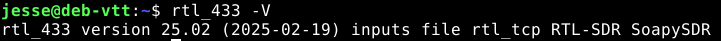

## c) Automaattinen analyysi

> Analysoi näyte rtl_433 ohjelmalla.

Avasin tehtävän annossa annetun tiedoston komennolla:

    $ rtl_433 -r /home/jesse/Downloads/Converted_433.92M_2000k.cs8

Sekä tehtävänannon vinkeissä, että rtl_433 dokumentaatiossa mainittiin tiedostomuodon nimellä olevan väliä: tiedoston nimessä pitää olla oikea taajuus ja näytteenottotaajuus, ja tiedostonimen osat erotetaan alaviivoilla. (Karvinen, verkkoon tunkeutuminen ja testaus & Larsson, GitHub rtl-433)

Tiedosto, jota tehtävässä analysoin oli nimeltään ``Converted_433.92M_2000k.cs8``, eli näyte oli tallennettu ``433,92 MHz``:n keskitaajuudella ja näytteenottotaajuus on ollut ``2000 kHz`` (eli 2 MHz).

Näytteessä näkyi saman 433 MHz:n signaalin toistoja. Signaali vastaanotettiin neljä kertaa aikaleimoilla:

    0.083284 s
    0.163125 s
    0.242956 s
    0.383568 s

Jokaisesta toistosta dekooderi on tulkinnut lähetyksen kolmelle eri mallille, jotka käyttävät laiteprotokollaa 51 (Larsson, GitHub rtl_433):

    KlikAanKlikUit-Switch
    Proove-Security
    Nexa-Security

Lisäksi jokaisesta toiston mallista löytyy sama id/housing code, sekä komento: ``OFF``.

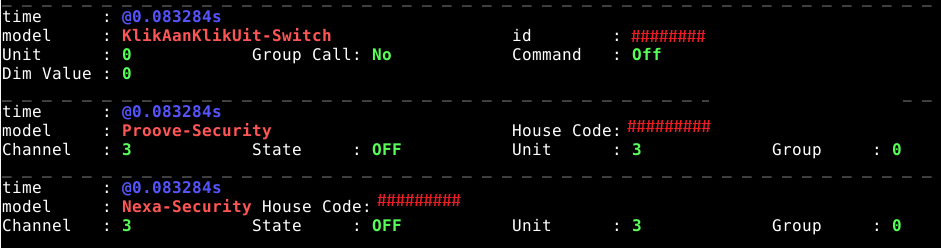

Googlettamalla tunnistettuja mallinimiä ``Proove-Security``, ``Nexa-Security`` ja ``KlikAanKlikUit-Switch`` selvisi, että kaikki kolme liittyivät 433 MHz taajuudella toimiviin langattomiin kodinohjauslaitteisiin, kuten kauko-ohjattaviin pistorasioihin, langattomiin kytkimiin ja muihin yksinkertaisiin älykotilaitteisiin.

Mikäli tulkintani ovat olleet edes sinne päin, signaalin voisi tulkita todennäköiseksi 433 MHz kodinohjauslaitteen OFF-komennoksi. Se voi olla esimerkiksi kauko-ohjaimen lähettämä pois päältä -signaali langattomalle pistorasialle tai kytkimelle.

## d) Too compex 16?

> Muuta URH:lla nauhoitettu .complex16s-näyte rtl_433-yhteensopivaksi ja analysoi se.

Näyte ``Recorded-HackRF-20250411_183354-433_92MHz-2MSps-2MHz.complex16s`` oli tallennettu URH-ohjelmalla ``.complex16s``-muodossa. rtl_433:n dokumentaation mukaan ``.complex16s`` vastaa ``.cs8``-formaattia, joten varsinaista signaalin muunnosta ei tarvittu.

Kuten aiemmassa tehtävässä, rtl_433 tarvitsee tiedostonimestä myös metatiedot taajuudesta ja näytteenottotaajuudesta. Alkuperäisestä tiedostonimestä päättelin, että keskitaajuus on ``433,92 MHz`` ja näytteenottotaajuus ``2MSps-2MHz`` ((Mega?) Samples per second - Megahertsiä) eli ``2000 kHz``.

Ensin yritin muuntaa tiedoston suoraan rtl_433 ``-w``-komennolla, mutta se ei tuottanut näkyvää tulosta

    $ rtl_433 -w /home/jesse/Downloads/Recorded1_433.92M_2000k.cs8 /home/jesse/Downloads/Recorded-HackRF-20250411_183354-433_92MHz-2MSps-2MHz.complex16s
    $ rtl_433 -r /home/jesse/Downloads/Recorded1_433.92M_2000k.cs8

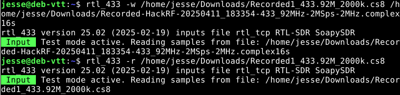

Pohdittuani hetken seuraavaa yritystä, luin tehtävänannon vinkeistä seuraavan lauseen: *Vain tiedoston nimi muuttuu.* Päätin seuraavaksi kokeilla kopioida tiedoston uudella rtl_433-yhteensopivalla nimellä:

    cp Recorded-HackRF-20250411_183354-433_92MHz-2MSps-2MHz.complex16s Recorded2_433.92M_2000k.cs8

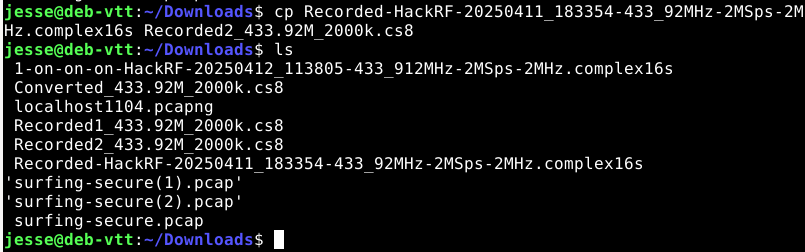

Kokeilin seuraavaksi avata uuden ``Recorded2_433.92M_2000k.cs8``-tiedoston rtl_433-ohjelmalla:

    $ rtl -r Recorded2_433.92M_2000k.cs8

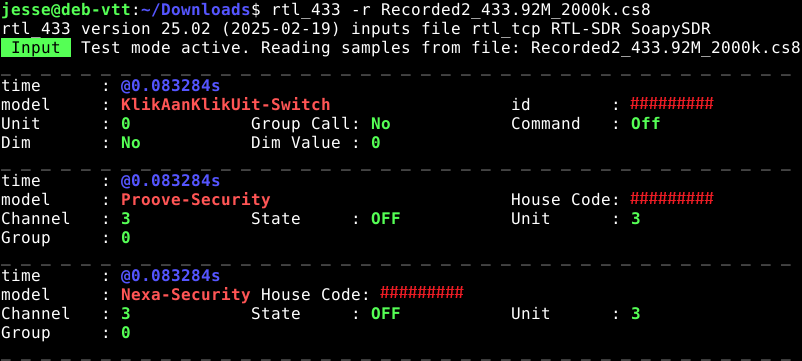

Uudella nimellä rtl_433-ohjelma osasi avata tiedoston tarkasteltavaksi. Analyysin tulos oli sama kuin edellisessä tehtävässä. Myös tästä näytteestä rtl_433 tunnisti saman 433 MHz:n signaalin toistot samoilla aikaleimoilla:

    0.083284 s
    0.163125 s
    0.242956 s
    0.383568 s

Jokaisessa toistossa dekooderi tulkitsi signaalin samoille malleille kuin aiemmin: 

    KlikAanKlikUit-Switch
    Proove-Security
    Nexa-Security

Kaikissa tulkinnoissa näkyi sama tunniste joko id- tai House Code -kentässä, ja komento oli `OFF`.

Uudelleennimetty ``Recorded2_433.92M_2000k.cs8`` sisälsi siis saman dekoodattavan signaalin kuin aiemman tehtävän ``Converted_433.92M_2000k.cs8``-tiedosto. Ja koska sain tuloksen esille, onnistui myös ``.complex16s``-tiedoston muuttaminen rtl_433:n ymmärtämään ``.cs8``-tiedostomuotoon.

## e) Ultimate

> Asenna URH, the Ultimate Radio Hacker. Tarkastele annettua .complex16s-näytettä.

Asensin URH:n tehtävänannon vinkeistä löytyvillä komennoilla ja käynnistin URH:n graafisen käyttöliittymän testatakseni asennuksen onnistuneen:

    $ sudo apt-get update
    $ sudo apt-get -y install pipx
    $ pipx install urh
    $ pipx ensurepath
    sulje ja avaa terminaali
    $ urh

Kuten asennusohjeista saattoi päätellä, pelkkä ``$ pipx install urh`` -komento ei riittänyt URH:n asentamiseen. Asennus antoi varoituksen:

    Note: '/home/jesse/.local/bin' is not on your PATH environment variable.

Varoitus tarkoitti, ettei ``/home/jesse/.local/bin`` ollut mukana PATH-ympäristömuuttujassa, joten komennot eivät olisi toimineet globaalisti.

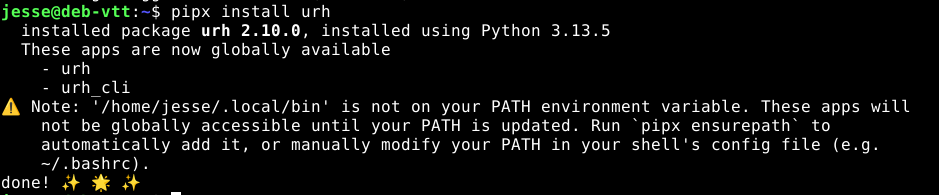

Tämä korjaantui asennusvaiheen seuraavalla komennolla, joka lisäsi hakemiston PATH-muuttujaan.

    $ pipx ensurepath

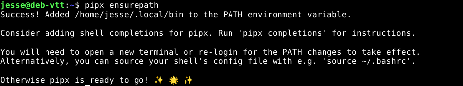

Terminaalin uudellenkäynnistys todennäköisesti vaadittiin siksi, että ``ensurepath`` lisäsi asennushakemiston PATH-ympäristömuuttujaan, mutta auki oleva terminaali ei päivitä ympäristömuuttujia automaattisesti. Tähän viittasi myös virhe ``command not found: urh``, kun kokeilin ajaa komennon ``urh`` ilman uudelleenkäynnistämistä.

Terminaalin uudelleenkäynnistämisen jälkeen tarkistin, että ohjelma käynnistyi komennolla:

    $ urh

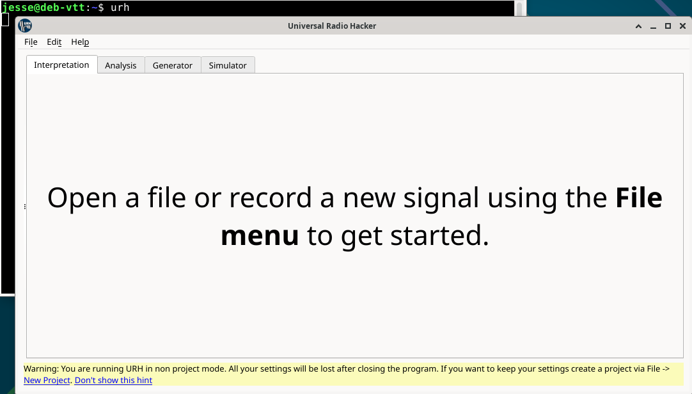

Avasin tarkasteltavan ``1-on-on-on-HackRF-20250412_113805-433_912MHz-2MSps-2MHz.complex16s``-tiedoston URH:n navigointipalkista Find -> Open.

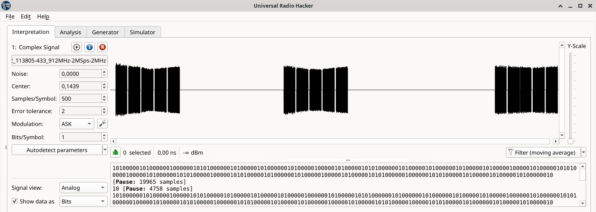

Näyte aukesi URH:n signaalinäkymään, jossa näkyy kolme selvästi erillistä signaaliryhmää. Tämä vastasi tehtävänannon kuvausta, jonka mukaan Nexan pistorasian kaukosäätimen valon 1 ON -painiketta on painettu kolme kertaa.

## f) Yleiskuva

> Kuvaile edellisen tehtävän näytettä yleisesti: kuinka pitkä, millä taajuudella, milloin nauhoitettu? Miltä näyte silmämääräisesti näyttää?

Tiedostonimestä pystyi päättelemään, että näyte on mitä ilmeisemmin nauhoitettu [HackRF](https://greatscottgadgets.com/hackrf/)-laitteella. Lisäksi tiedostonimen perusteella näyte on nauhoitettu ``12.4.2025 klo 11:38:05``. Näytteen keskitaajuus on ollut 433,912 MHz ja näytteenottotaajuus 2 MHz.

Kuten aiemmassa tehtävässäkin jo analysoin, URH:n näkymässä signaali koostui kolmesta selvästi erillisestä pulssiryhmästä. Ryhmien välissä oli pitkät tauot, jotka URH näytti myös [Pause: ... samples] -merkintöinä bittinäkymässä. Tämä sopi tehtävänannon kuvaukseen, jonka mukaan Nexan pistorasian kaukosäätimen valon 1 ON -painiketta oli painettu kolme kertaa.

URH:n Interpretation-välilehdeltä löytyi info-painike, josta aukesi Signal Details -ikkuna. Tästä ikkunasta saatiin näytteen perustiedot, kuten tiedostokoko, näytteiden määrä, näytteenottotaajuus ja kesto.

Aluksi URH näytti näytteenottotaajuudeksi ``1,0M``, mutta tiedostonimen perusteella mielestäni oikea arvo oli ``2,0M``. Asetin Sample Rate -kenttään arvoksi ``2,0M``, minkä jälkeen URH laski näytteen kestoksi ``2,75 sekuntia``.

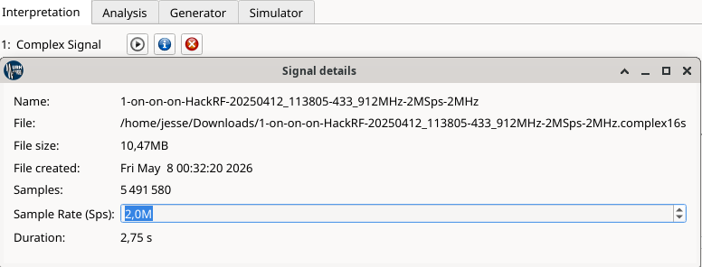

``File Created`` -kohta vaikutti olevan tiedoston "luontipäivä" tietokoneelle, omassa tapauksessani siis latausajankohta. Testasin tämän väittämän lataamalla näytteen uudestaan ja avaamalla kyseisen tiedoston URH:lla. ``1-on-on-on...(2).complex16s``-tiedoston ``File Created`` -ajankohta vastasi toukokuun yhdeksännen aurinkoista lauantai-iltaa.

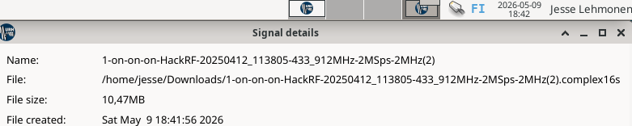

Koska en ollut varma, oliko ``1,0M`` sps vain oletusarvo näytteenottotaajuuteen vai kuuluiko arvo vaihtaa tiedostonimestä pääteltyyn ``2,0M `` taajuuteen (vai olisiko tiedostonimessä jopa pieni jekku???), kokeilin tarkistaa mitä rtl_433:n avulla näytteestä saisi nopeasti selville. Loin näytteestä kaksi eri rtl_433 yhteensopivaa tiedostoa, 1 MHz:n ja 2 MHz:n näytteenottotaajuuksilla:

    $ cp "1-on-on-on-HackRF-20250412_113805-433_912MHz-2MSps-2MHz(2).complex16s" "1-on_433.92M_2000k.cs8"
    $ cp 1-on_433.92M_2000k.cs8 2-on_433.92M_1000k.cs8

Avasin tämän jälkeen molemmat näytteet, aloittaen 2 MHz:n näytteestä komennoilla:

    rtl_433 -r 1-on_433.92M_2000k.cs8
    rtl_433 -r 2-on_433.92M_1000k.cs8

2 MHz:n näytteestä erottui selkeästi kolme erillistä ajanjaksoa, jotka todennäköisesti ovat kaukosäätimen painallukset:

    1. painallus: noin 0.11–0.27 s
    2. painallus: noin 1.13–1.37 s
    3. painallus: noin 2.41–2.65 s

Jokaisessa jaksossa sama ON-komento toistui useita kertoja samalla tunnisteella.

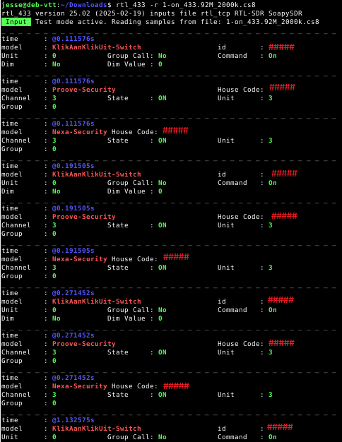

Sen sijaan 1000k-merkinnällä tehty 1 MHz:n tiedosto ei tuottanut vastaavaa dekoodausta. rtl_433 kyllä avasi tiedoston, mutta ei tunnistanut siitä viestejä. URH:n ``1,0M`` sps arvo oli siis mitä todennäköisimmin oletusarvo.

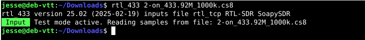

## g) Bittistä

> Demoduloi signaali. Mikä on oikea modulaatio? Miten pitkä yksi raakabitti on ajassa?

Aloitin tehtävän avaamalla ensimmäisenä lataamani tiedoston ``1-on-on-on-HackRF-20250412_113805-433_912MHz-2MSps-2MHz.complex16s`` ja painamalla ``Autodetect parameters``. 

ASK (Amplitude Shift Keying) muuttaa signaalin amplitudia, FSK (Frequency Shift Keying) taajuutta ja PSK (Phase Shift Keying) vaihetta ([linkin](https://resources.l-p.com/knowledge-center/ask-vs-fsk-vs-psk-which-modulation-method-should-you-choose) takana havainnollistava kuva). Koska URH:ssa näyte näkyi selvinä amplitudipulsseina ja taukoina, eikä kahtena eri taajuutena tai vaihehyppyinä, sai modulaatio pysyä ASK:na. (Link-PP, ASK vs FSK vs PSK: Unlocking the Secrets of Digital Modulation)

Seuraavaksi valitsin ``Signal view`` -kohdasta näkymäksi ``Demodulated``, jolloin URH näytti signaalin demoduloidussa muodossa. Lisäksi ``Show data as`` -kohdassa valitsin ``Bits``, jolloin ohjelma näytti alareunassa signaalista tulkitut raakabitit.

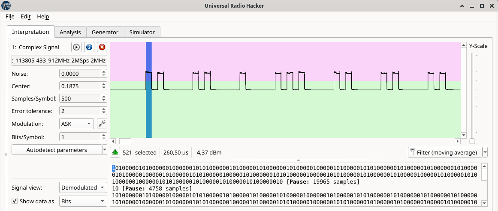

Maalasin URH:n näkymästä yhden yksittäisen raakabitin kohdan, joka näkyi alareunan bittijonossa arvona 1. Valinnan pituudeksi URH näytti ``521`` samplea ja ``260,50`` mikrosekuntia. 521 valittua samplea vastasi annettua Samples/Symbol -arvossa määriteltyä bitin pituutta 500. Ajallisesti raakabitin pituus oli siis 260,50 µs.

Tämän pystyi myös tarkistamaan matemaattisesti. Ajan ja näytteenottotaajuuden suhde voidaan esittää muodossa t = n / fs, jossa n tarkoittaa näytteiden määrää ja fs näytteenottotaajuutta. Tämän perusteella yhden raakabitin aika saadaan jakamalla bitin näytemäärä näytteenottotaajuudella. (Brian McFee Digital Signals Theory, 2.1. Sampling period and rate)

    500 / 2000000 = 0,00025s = 250µs

Tässä ajassa valo olisi ehtinyt kulkea Pasilasta jonnekin Riihimäen pohjoispuolelle (~75 kilometriä). Tai moottoritiellä 120 km/h kulkeva auto olisi edennyt riisinjyvän pituuden eteenpäin (8,3 millimetriä). (Laskutehtävät ChatGPT)

## Lähteet

Tero Karvinen
- Verkkoon tunkeutuminen ja testaus, h7 Aaltoja harjaamassa: https://terokarvinen.com/verkkoon-tunkeutuminen-ja-tiedustelu/#h7-aaltoja-harjaamassa

Martin Hubacek, Youtube @Hubmartin
- Universal Radio Hacker SDR Tutorial on 433 MHz radio plugs: https://www.youtube.com/watch?v=sbqMqb6FVMY&t=199s

Cornelius
- Decode 433.92 MHz weather station data: https://www.onetransistor.eu/2022/01/decode-433mhz-ask-signal.html

Benjamin Larsson, Github
- rtl-433: https://github.com/merbanan/rtl_433
- rtl-433, File name meta data: https://github.com/merbanan/rtl_433/blob/ac1e4a8c5a36fb90e3b06c0f01cef00bb3b2614d/docs/IQ_FORMATS.md#file-name-meta-data

Link-PP Community
- ASK vs FSK vs PSK: Unlocking the Secrets of Digital Modulation: https://resources.l-p.com/knowledge-center/ask-vs-fsk-vs-psk-which-modulation-method-should-you-choose

Brian McFee, Digital Signals Theory
- 2.1. Sampling Period and rate: https://brianmcfee.net/dstbook-site/content/ch02-sampling/Sampling.html

ChatGPT
- Laskutehtävät 250 µs esimerkkeihin